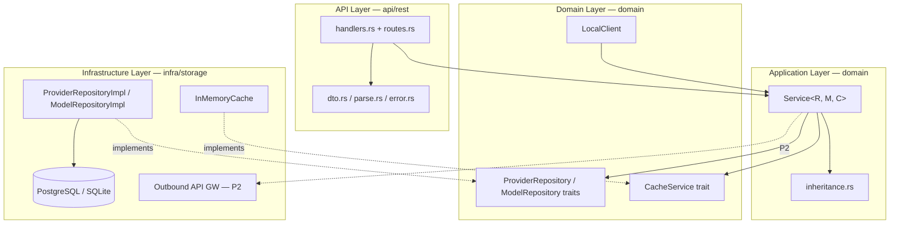
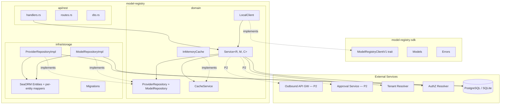
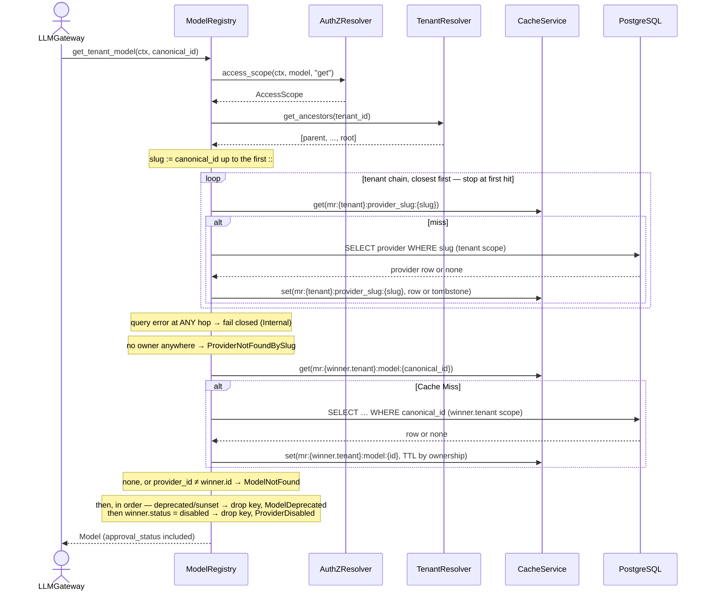
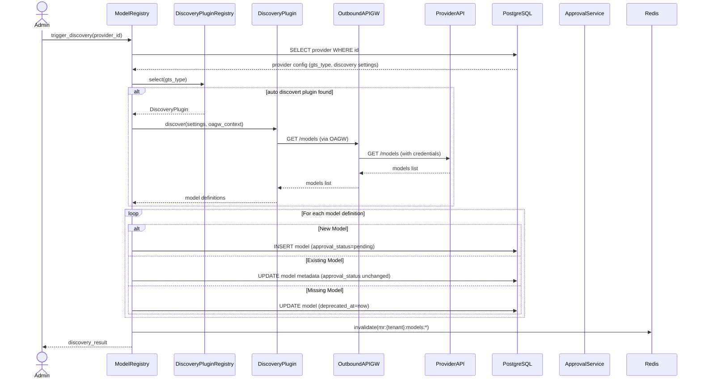
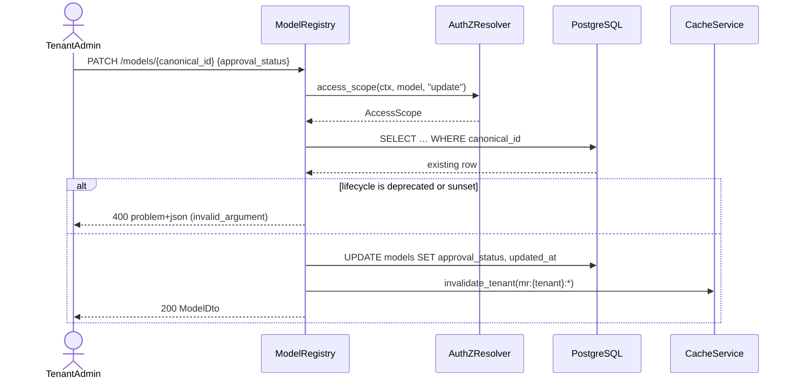
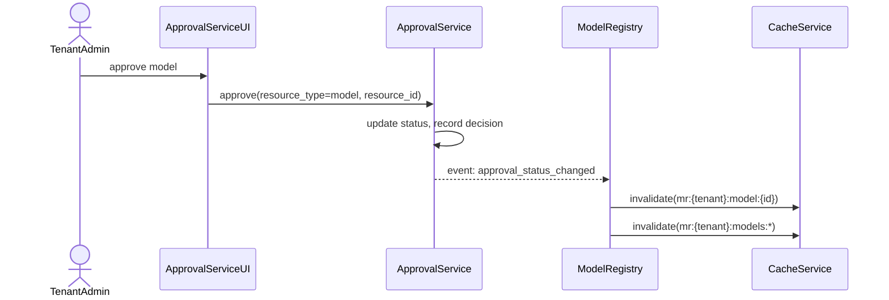
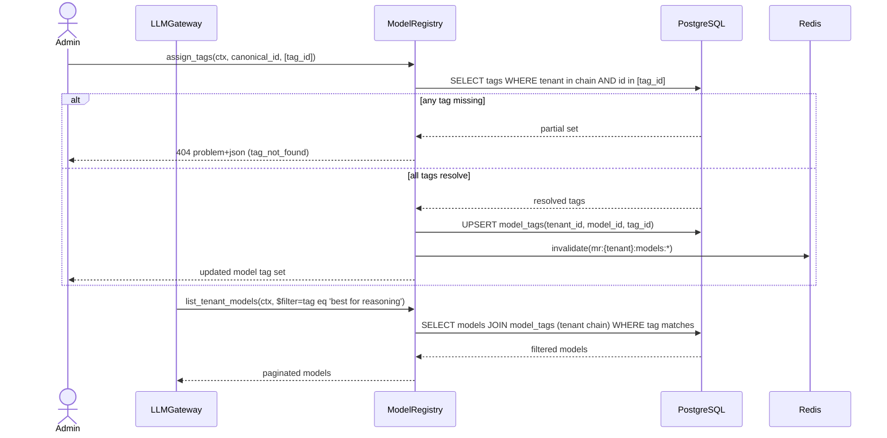

<!-- Updated: 2026-08-03 by Constructor Tech -->

# Technical Design — Model Registry


<!-- toc -->

- [1. Architecture Overview](#1-architecture-overview)
  - [1.1 Architectural Vision](#11-architectural-vision)
  - [1.2 Architecture Drivers](#12-architecture-drivers)
  - [1.3 Architecture Layers](#13-architecture-layers)
- [2. Principles & Constraints](#2-principles--constraints)
  - [2.1 Design Principles](#21-design-principles)
  - [2.2 Constraints](#22-constraints)
- [3. Technical Architecture](#3-technical-architecture)
  - [3.1 Domain Model](#31-domain-model)
  - [3.2 Component Model](#32-component-model)
  - [3.3 API Contracts](#33-api-contracts)
  - [3.4 Internal Dependencies](#34-internal-dependencies)
  - [3.5 Interactions & Sequences](#35-interactions--sequences)
  - [3.6 Database schemas & tables](#36-database-schemas--tables)
- [4. Additional Context](#4-additional-context)
  - [Error Handling](#error-handling)
  - [Cache Invalidation Strategy](#cache-invalidation-strategy)
  - [Security Considerations](#security-considerations)
  - [Data Protection](#data-protection)
  - [Consistency Model](#consistency-model)
  - [Capacity & Cost](#capacity--cost)
  - [Fault Tolerance Policies](#fault-tolerance-policies)
  - [Dependency SLAs](#dependency-slas)
  - [Technical Debt & Roadmap](#technical-debt--roadmap)
  - [Documentation Strategy](#documentation-strategy)
  - [Testing Strategy](#testing-strategy)
  - [Data Governance](#data-governance)
  - [Out of Scope / Not Applicable](#out-of-scope--not-applicable)
- [5. Traceability](#5-traceability)

<!-- /toc -->

## 1. Architecture Overview

### 1.1 Architectural Vision

Model Registry provides a centralized catalog of AI models with tenant-level availability and approval status. The service is the authoritative source for model metadata, capabilities, API resolution (provider routing and OAGW alias), default inference parameters, context window limits, cost data, and tenant access control. LLM Gateway queries the registry to resolve model identifiers to provider routing and to read the tenant's approval state for a model.

The architecture follows the Gears SDK pattern with clear separation between public API surface (`model-registry-sdk`) and implementation (`model-registry`). The system is optimized for high read throughput (1000:1 read:write ratio) behind a cache-first read path abstracted by the `CacheService` trait. **P1 ships one backend — the in-process `InMemoryCache`**; the `redis` Cargo feature is declared as the seam for a distributed backend and carries no implementation yet. Provider API calls for model discovery route through Outbound API Gateway; that is a P2 capability — P1 makes no outbound provider calls at all and populates the catalog exclusively from admin writes.

The design emphasizes tenant isolation with hierarchical inheritance. Providers and models are visible additively over the tenant ancestor chain resolved from `tenant-resolver`. Shadowing is keyed on the **provider slug and only on the provider slug** — a child tenant that registers a provider under an inherited slug takes that slug over for its subtree, and the shadowed provider's entire model set leaves with it. There is no model-level shadow. Model visibility is then set membership on `provider_id`; the algorithm all three read paths share is §3.5 "Tenant Visibility Resolution". Cache isolation ensures tenant data separation via a tenant-ID key prefix, TTL-based expiry by ownership (own 30 minutes, inherited 5 minutes), and whole-tenant invalidation on every write.

**Implementation status**: the full P1 scope described in §1.2, §3.3, and §3.6 is implemented in [`model-registry/`](../model-registry/) (gear `model-registry`, package `cf-gears-model-registry`, feature-gated in `cf-gears-example-server`). This includes all shadowing, visibility-resolution, and management-listing changes from the provider-shadowing plan — see §3.5 "Tenant Visibility Resolution" for the algorithm and §4 Technical Debt for the closed items. Sections and rows marked P2/P3/P4 are forward-looking design and are absent from both the `ModelRegistryClientV1` trait and the REST surface until their phase is scheduled.

### 1.2 Architecture Drivers

#### Functional Drivers

Checked drivers are implemented in the gear crate and covered by its unit and SQLite integration suites. Unchecked drivers are designed below but intentionally absent from the P1 SDK trait and REST surface.

- [x] `p1` — `cpt-cf-model-registry-fr-tenant-isolation` — `AccessScope` applied to every `SecureConn` query, plus a tenant-ID prefix on every cache key
- [x] `p1` — `cpt-cf-model-registry-fr-authorization` — every service method derives its `AccessScope` from the `authz-resolver` PDP through `PolicyEnforcer` (resource types `model_registry.provider` / `model_registry.model`; actions `get`, `list`, `create`, `update`, `delete`)
- [x] `p1` — `cpt-cf-model-registry-fr-input-validation` — wire-string → enum parsing in the REST layer with a field-violation problem on an unknown value; slug, discovery-interval and lifecycle-transition validation in the service; identity fields structurally absent from the update request types
- [x] `p1` — `cpt-cf-model-registry-fr-cache-isolation` — Cache key format `mr:{tenant_id}:{entity}:{id}`, TTL by ownership, `invalidate_tenant` scoped by key prefix
- [x] `p1` — `cpt-cf-model-registry-fr-get-tenant-model` — Cache-first lookup across the tenant chain with DB fallback; `approval_status` is **returned on the model, not enforced** — the caller decides (§3.5). The lookup first resolves the winning provider for the `canonical_id`'s slug and then reads the model under that winner's tenant only, requiring `provider_id == winner.id` — see §3.5 "Tenant Visibility Resolution" for the algorithm and its failure semantics
- [x] `p1` — `cpt-cf-model-registry-fr-list-tenant-models` — Cursor pagination with `$filter` / `$orderby` over real columns (`$select` is rejected — see §3.3), merged additively across the ancestor chain. Visibility is `provider_id ∈ allow_list` — one predicate carrying both the shadow gate and the disabled-provider gate (§3.5 "Tenant Visibility Resolution"). Deduping ancestor rows by `canonical_id` is not that predicate: an ancestor model with no colliding `canonical_id` at the closer tenant survives a dedupe even though its provider's slug has been shadowed. The predicate is **unconditional and mandatory**, ANDed onto the caller's query — not a default that a `$filter` clause can switch off (§3.3 "Two listing endpoints — eval vs management")
- [x] `p1` — `cpt-cf-model-registry-fr-manual-model-management` — Admin CRUD on models with `approval_status` patched via `update_model`; the same REST surface continues to accept admin calls in P2 but routes them through the Approval Service. Model creation MUST resolve `provider_slug` within the caller's own tenant only — a model's `tenant_id` MUST equal its provider's `tenant_id` — rejecting an inherited (ancestor-owned) provider with a new `provider_not_owned` error (§3.1 Invariants, §4 Error Handling)
- [x] `p1` — `cpt-cf-model-registry-fr-provider-management` — CRUD with inheritance/shadowing support, and a referential pre-check that refuses to delete a provider that still owns models. Shadowing a provider (slug-keyed, closest-tenant-wins resolution) must also hide every model attached to it from `list_tenant_models` / `get_tenant_model`, and disabling a provider must make its models unavailable for eval. Both effects fall out of one mechanism — the provider loses its place in `allow_list`, so no model carrying its `provider_id` resolves (§3.5 "Tenant Visibility Resolution")
- [x] `p1` — `cpt-cf-model-registry-fr-list-tenant-models-management` — A **second listing endpoint** (`GET /model-registry/v1/admin/models`), separate from `list_tenant_models`: tenant-admin/platform-admin authorization, a wider candidate row set (it keeps the rows whose provider *lost* slug resolution, and the rows on a disabled provider, both marked), none of the eval mandatory predicates, and its own response type carrying `shadowed` / `provider_disabled` / `available_for_eval` — all three computed from the same `ChainProviders` structure the eval path filters on (§3.5 "Tenant Visibility Resolution"). Deprecated rows arrive through an explicit `include_deprecated` flag, never through `$filter`. The OData field enum, `FieldToColumn` binding, cursor encoding and ancestor-merge code are shared with `list_tenant_models` via one repository query parameterized by a visibility mode — see §3.3 "Two listing endpoints — eval vs management"
- [ ] `p1` — `cpt-cf-model-registry-fr-model-pricing` — AICredits cost data whose **shape follows the provider's own cost structure** (`OpenAiCost`, `AnthropicCost`, …) — rate dimensions, tiers and units differ per provider and there is no cross-provider normalized cost schema (§3.1). Storage only in P1: the `cost` block rides nested inside each model's `provider_settings` and travels with model info; there is no separate pricing surface and no AICredits integration
- [ ] `p2` — `cpt-cf-model-registry-fr-model-discovery` — OAGW integration, provider plugin abstraction
- [ ] `p2` — `cpt-cf-model-registry-fr-model-approval` — Approval Service integration, event-driven status sync; replaces P1 admin-direct status writes on the same endpoints
- [ ] `p2` — `cpt-cf-model-registry-fr-bulk-operations` — Batch approval via Approval Service
- [ ] `p2` — `cpt-cf-model-registry-fr-manual-trigger` — Manual discovery API endpoint (`POST /providers/{id}/discover`); the same endpoint is the integration point for optional external schedulers (platform scheduler, Kubernetes CronJob) — the module does not embed its own scheduler (health probe trigger added in P3)
- [ ] `p3` — `cpt-cf-model-registry-fr-auto-approval` — Approval Service criteria schema, rule evaluation delegation
- [ ] `p3` — `cpt-cf-model-registry-fr-health-monitoring` — Health status derived from discovery calls, stored per provider
- [ ] `p3` — `cpt-cf-model-registry-fr-alias-management` — Alias table with tenant hierarchy resolution
- [ ] `p3` — `cpt-cf-model-registry-fr-tag-management` — `tags` table with tenant hierarchy resolution (same inheritance/shadowing model as aliases); managed independently of the model catalog
- [ ] `p3` — `cpt-cf-model-registry-fr-model-tagging` — `model_tags` join table (many-to-many, tenant-scoped); OData `tag` filter via join; cascade removal on tag delete
- [ ] `p3` — `cpt-cf-model-registry-fr-degraded-mode` — Tiered behavior: metadata from cache, approval check fails
- [ ] `p3` — `cpt-cf-model-registry-fr-tenant-reparenting` — Cache invalidation on `tenant.reparented` event
- [ ] `p4` — `cpt-cf-model-registry-fr-user-group-approval` — Group-scoped approval restriction layer
- [ ] `p4` — `cpt-cf-model-registry-fr-user-level-override` — User-level override takes precedence over group/tenant

#### NFR Allocation

| NFR ID | NFR Summary | Allocated To | Design Response | P1 status | Verification Approach |
|--------|-------------|--------------|-----------------|-----------|----------------------|
| `cpt-cf-model-registry-nfr-performance` | get_tenant_model <10ms P99 | Cache Layer + Repository | Cache-first read with 30min TTL for own data, 5min for inherited | Implemented against the in-process `InMemoryCache`; a distributed backend is the `redis` feature seam | Benchmarks deferred — no measured P99 yet (§4 Technical Debt) |
| `cpt-cf-model-registry-nfr-availability` | 99.9% uptime | Service + Cache | Stateless design, cache miss falls through to DB | Implemented. **No fail-closed approval gate** — `get_tenant_model` returns the model with its `approval_status` regardless of value | Availability monitoring, SLO dashboards (platform) |
| `cpt-cf-model-registry-nfr-scale` | 10K tenants, 2M models | Repository + Cache | Cache isolation by tenant, B-tree indexes on every filterable column, `SecureConn` pooling | Schema and indexes in place | Load testing at scale targets — not yet run |

**Error budgets & alerting thresholds** (target posture; the signals themselves land with platform observability integration): availability NFR `99.9%` translates to a 30-day error budget of ~43 minutes of downtime per month; latency NFR `<10ms P99 on get_tenant_model` is alerted on a 5-minute rolling window above `15ms` (warn) / `25ms` (page). The management model listing (§3.3) carries no latency SLO. The discovery path is excluded from the user-facing latency SLO — its budget is end-to-end discovery latency above the configured `discovery_interval_seconds` per provider. Module-level alerting routes to the platform observability stack (see §4 Out of Scope "Observability") so dashboards/alerts/runbooks live alongside the platform's other modules.

#### Architecture Decisions

The following ADRs capture the load-bearing decisions that shape this design. Each ADR is referenced from the principle or constraint it materializes (see §2).

| ADR ID | Decision | Materialized By | P1 status |
|--------|----------|-----------------|-----------|
| `cpt-cf-model-registry-adr-pluggable-cache` | Pluggable cache behind the `CacheService` trait with TTL-based expiry | `cpt-cf-model-registry-principle-cache-first` | Trait + `InMemoryCache` shipped; `redis` feature declared, backend not written |
| `cpt-cf-model-registry-adr-tenant-inheritance` | Additive provider/model inheritance with slug-keyed child-shadowing semantics | `cpt-cf-model-registry-principle-additive-inheritance`, `cpt-cf-model-registry-seq-resolve-tenant-visibility` | Provider-slug shadowing implemented in `domain/inheritance.rs` for provider reads. Same-tenant-only model creation and the `provider_id`-keyed model visibility rule (§3.5) are implemented — the shipped code now resolves `ChainProviders` on every read path |
| `cpt-cf-model-registry-adr-approval-delegation` | Delegate approval workflow (state machine, notifications, audit) to generic Approval Service | `cpt-cf-model-registry-principle-approval-delegation` | P2. P1 writes `models.approval_status` directly from `update_model`, keeping the seam intact |
| `cpt-cf-model-registry-adr-oagw-provider-access` | All provider API calls route through Outbound API Gateway (no direct provider calls) | `cpt-cf-model-registry-constraint-oagw-dependency` | P2. P1 makes no outbound calls, so the constraint is vacuously held |
| `cpt-cf-model-registry-adr-gts-typed-provider-settings` | GTS-typed provider settings: `ModelInfoV1<P: GtsSchema = serde_json::Value>` envelope with per-provider GTS leaves; `gts_type` is the canonical discriminator for storage and the SDK | `cpt-cf-model-registry-component-sdk` | Implemented; `gts_type` is a scalar column keying the `provider_settings` blob |

### 1.3 Architecture Layers



| Layer | Responsibility | Technology |
|-------|---------------|------------|
| API | Request/response handling, wire-string parsing, `OData` query extraction, `Problem` mapping | REST/OpenAPI via `OperationBuilder`, Axum handlers, `utoipa` DTOs |
| Application | Authorization, cache orchestration, inheritance resolution, validation | `Service<R, M, C>` generic over both repository traits and the cache backend |
| Domain | Repository traits, cache trait, domain errors, SDK client impl | Rust traits, `async-trait`; `LocalClient` registered in ClientHub as `dyn ModelRegistryClientV1` |
| Infrastructure | Data persistence, entity ↔ SDK mapping, `OData` field binding, in-process cache | SeaORM entities + migrations, `SecureConn`/`AccessScope`, `InMemoryCache` |

The service is generic over `(ProviderRepository, ModelRepository, CacheService)`; the gear wires the concrete triple `Service<ProviderRepositoryImpl, ModelRepositoryImpl, InMemoryCache>`, and tests substitute mock tenant/authz clients against the same generic surface.

## 2. Principles & Constraints

### 2.1 Design Principles

#### Tenant Isolation

**ID**: `cpt-cf-model-registry-principle-tenant-isolation`

All operations are scoped by tenant context. Cache keys include tenant ID prefix. Query filters enforce tenant hierarchy visibility. Write operations validate tenant ownership. Admin operations verify actor role for target tenant.

Realization: every service method first calls the `authz-resolver` PDP to obtain an `AccessScope`, every repository trait method takes that scope as a required parameter, and every query in both implementations is issued through `.secure().scope_with(scope)` rather than a raw SeaORM query — so an unscoped query is visible as a missing `.secure()` call at review time. Reads that consult ancestor tenants build an explicit `AccessScope::for_tenant(ancestor_id)` per ancestor rather than widening the caller's own scope.

#### Cache-First Reads

**ID**: `cpt-cf-model-registry-principle-cache-first`

Read operations check the cache before the database. *Which* tenants get probed depends on the entity, and the difference is load-bearing: provider-slug ownership is resolved by walking the chain closest-first and stopping at the first owner, whereas a model is read under the winning provider's tenant **only** — probing the chain closest-first for a model and returning on the first hit would serve a cached ancestor row to a subtree that has shadowed its provider, since the hit path performs no slug resolution (§3.5 sub-decision 2). Cache misses populate the cache from DB. TTL-based expiry prevents stale data accumulation. Own data uses 30-minute TTL; inherited data uses 5-minute TTL for faster propagation of parent changes; both are configurable (`own_ttl_seconds`, `inherited_ttl_seconds`). The backend sits behind the `CacheService` trait — P1 ships `InMemoryCache` only, and a distributed backend plugs in behind the declared `redis` Cargo feature without touching the service.

Three cache entities exist: `mr:{tenant_id}:provider:{provider_id}`, `mr:{tenant_id}:model:{canonical_id}`, and `mr:{tenant_id}:provider_slug:{slug}` — the last one keyed by slug rather than UUID so `get_tenant_model` can resolve slug ownership per chain hop without a DB round-trip, and storing negative results as well as positive ones (§3.5 sub-decision 3). List responses are **not** cached — only single-entity reads are. Invalidation is coarse: any write invalidates the writer tenant's whole key prefix (see §4 Cache Invalidation Strategy).

#### Additive Inheritance

**ID**: `cpt-cf-model-registry-principle-additive-inheritance`

Providers and models inherit down the tenant hierarchy additively. Child tenants see their ancestors' providers and models plus their own. A child shadows an inherited provider by creating one with the same slug; shadowing replaces the parent's provider **and every model attached to it** for that tenant and its descendants. Child tenants cannot expand beyond parent's permissions.

Realization: `resolve_ancestors` fetches the chain from `tenant-resolver` on every read; slug resolution runs over the chain's providers (§3.5); the own-tenant model query carries the caller's `OData` filter and pagination, each ancestor query carries the same filter with pagination removed so the merge sees each ancestor's complete visible set, and the merged result is then truncated to the caller's limit. Ownership classification (`Own` vs `Inherited`) selects the cache TTL.

**Model ownership is same-tenant-only**: a model always belongs to exactly one provider, and a model's `tenant_id` MUST equal its provider's `tenant_id`. There is no independent "model-level shadow" distinct from provider shadowing — a colliding `canonical_id` at a closer tenant is simply a consequence of that tenant owning its own provider of the same slug. Concretely this means:

- **Model creation is scoped to the caller's own tenant's providers only.** A child tenant can never create a model — manually or via auto-discovery — against a provider owned by an ancestor tenant, shadowed or not. Model creation's provider lookup MUST resolve `provider_slug` within the caller's own tenant only, returning `provider_not_owned` when the slug resolves only in an ancestor (§3.1 Invariants, §4 Error Handling).
- **Shadowing a provider hides every model attached to it, not just the provider record.** A model row is visible only when its `provider_id` is the winning provider for its slug in the requester's tenant chain. Matching purely on `canonical_id` is not sufficient: an ancestor's model whose provider slug has been shadowed by a closer tenant must be excluded even when no colliding `canonical_id` exists at that closer tenant. The management listing is the one read that deliberately keeps these rows, marked `shadowed` and read-only (§3.3).
- **Disabling a provider makes every model attached to it unavailable for eval.** `get_tenant_model` / `list_tenant_models` MUST treat every model of a disabled provider as unavailable, independent of that model's own `approval_status`. The management listing again keeps them, with the flag visible instead of filtering them out (§3.3).

Both exclusions are one mechanism, not two: a shadowed provider and a disabled provider alike fail to enter the requester's allow-list, so no model carrying their `provider_id` resolves. The algorithm — the `ChainProviders` structure, the `provider_id ∈ allow_list` rule, per-path pseudocode, failure semantics, and the cache entities it needs — is specified once in §3.5 "Tenant Visibility Resolution" and is not restated here.

#### Approval Service Delegation

**ID**: `cpt-cf-model-registry-principle-approval-delegation`

**Phase**: P2 — the delegation itself is not implemented in P1.

Model Registry does not implement approval workflow logic. It delegates to a generic Approval Service that handles state machine, concurrency control, and audit trail. Model Registry registers models as approvable resources and reacts to approval status change events.

P1 keeps the seam without the service: `approval_status` is a first-class column on `models`, set on create (default `pending`) and patched by `update_model`. There is no workflow state machine, no notification, and no audit trail in this module — the only guard is that approval cannot be changed on a model in a terminal lifecycle state (`deprecated` / `sunset`). P2 replaces the write path only; reads and `$filter` continue to serve from the same column.

#### Discovery Plugin Extensibility (P2)

**ID**: `cpt-cf-model-registry-principle-discovery-plugin-extensibility`

**Phase**: P2 — model discovery is manual-only in P1; plugin-based discovery lands with the P2 discovery capability.

Model Registry does not hard-code provider-specific discovery protocols. Each provider's GTS type is served by exactly one discovery plugin selected from the registered set. Adding a new provider's discovery capability requires only shipping a new plugin — no changes to existing plugins and no changes to the registry's core discovery path. Plugin payloads are GTS-typed so per-plugin settings schemas evolve independently.

#### Conflict Ordering

When two principles produce conflicting guidance, resolve in this order: **tenant-isolation > approval-delegation > additive-inheritance > cache-first**. Tenant isolation is non-negotiable; approval delegation overrides inheritance when an Approval Service decision is authoritative; additive inheritance overrides cache-first when an inherited row must be re-fetched after an invalidation event.

### 2.2 Constraints

#### Outbound API Gateway Dependency

**ID**: `cpt-cf-model-registry-constraint-oagw-dependency`

**Phase**: P2 — P1 makes no outbound provider calls, so the gear declares no OAGW dependency yet (`deps = ["tenant-resolver", "authz-resolver"]`).

All provider API calls for model discovery must route through Outbound API Gateway. OAGW handles credential injection, circuit breaking, and outbound URL policy enforcement. Direct provider calls are not permitted.

#### No Credential Storage

**ID**: `cpt-cf-model-registry-constraint-no-credentials`

Model Registry does not store provider credentials. Provider configuration includes slug, name, GTS type, and discovery settings. All provider access routes through OAGW upstreams; the routing alias (`oagw_alias`) is **not** a provider-level field — it lives on each model's per-provider settings (`provider_settings.oagw_alias`, e.g. `OpenAiSettingsV1` / `AnthropicSettingsV1`), because it is provider-specific and some providers may not need it. Credential management is OAGW responsibility.

#### Approval Service Integration

**ID**: `cpt-cf-model-registry-constraint-approval-service`

**Phase**: P2 — see `cpt-cf-model-registry-principle-approval-delegation` for the P1 stand-in.

Approval workflow (state machine, notifications, audit) is handled by generic Approval Service. Model Registry provides model-specific criteria schema for auto-approval rules. This constraint ensures consistent approval patterns across the platform.

#### Immutable Provider Slugs

**ID**: `cpt-cf-model-registry-constraint-immutable-slugs`

Provider slugs are immutable after creation. Changing a slug would invalidate all canonical model IDs referencing that provider. Slug format: 1-64 chars, lowercase alphanumeric + hyphen, unique within tenant — validated in the service on create; the update path simply never projects `slug`, so a slug in a PATCH body is ignored rather than rejected.

#### Content Logging Restrictions

**ID**: `cpt-cf-model-registry-constraint-content-logging`

Provider cost data and model capabilities are not PII, but discovery responses may contain sensitive provider information. Logging includes only metadata (tenant, provider slug, model count, latency).

#### Constraint Applicability — Not Applicable

The constraint families below are explicitly **not applicable** to Model Registry v1. They are recorded here so reviewers can distinguish "considered and excluded" from "forgotten":

- **Regulatory constraints**: Not applicable in v1 — Model Registry stores model metadata, provider routing, and approval status, but no PII, PHI, PCI, or other regulated data. Revisit when EU/HIPAA/FedRAMP tenants onboard or if discovery surfaces start carrying regulated content.
- **Vendor / licensing constraints**: Not applicable — all shipped dependencies (`SeaORM`, `axum`, `gts`, `tokio`, `serde`, `utoipa`, `chrono`, `uuid` plus the workspace `toolkit-*` crates) are MIT/Apache-2.0 dual-licensed and pass `make deny`. No proprietary, copyleft, or restrictive components are introduced; no vendor exclusivity clauses apply. A Redis client is not a dependency in P1.
- **Data-residency constraints**: Not applicable at the Model Registry layer. Storage residency is delegated to the platform's chosen PostgreSQL deployment; the registry does not pin a region. Tenant-level residency policy, when introduced, will live at the platform deployment layer rather than inside this module.
- **Resource constraints (budget / team / time)**: Not applicable as architectural constraints. Resource planning is owned by program management and is not a property the design encodes; engineering capacity for the v1 scope is tracked outside this document.
- **Legacy-integration constraints**: Not applicable — Model Registry is a new module with no legacy database, no migration from a prior catalog, and no backward-compatibility commitment to a pre-existing Model Registry contract. The pre-GTS `AnyProviderSettings` / `ProviderKind` carrier was removed in the same change set as this design (see [`cpt-cf-model-registry-adr-gts-typed-provider-settings`](./ADR/0005-cpt-cf-model-registry-adr-gts-typed-provider-settings.md)) and never shipped to production.

## 3. Technical Architecture

### 3.1 Domain Model

**Technology**: Rust structs (SDK models)

**Location**: [`model-registry-sdk/src/models/`](../model-registry-sdk/src/models/) — split per concern into `common.rs`, `info.rs`, `entity.rs`, `default_parameters.rs` (the unified `DefaultInferenceParametersV1` and its supporting types — `TextFormat`/`TextFormatKind`/`TextVerbosity`, `ReasoningConfig`/`ReasoningSummary`, `ToolChoice`, `TruncationStrategy`), `request.rs`, plus a `providers/` subdirectory with one file per shipped provider (current shipped set: `openai.rs`, `anthropic.rs`; the directory is the documented extension point — adding a new provider doesn't require touching anything else). The narrowed `ServiceTier` (`Auto | Default`) stays in `common.rs`; provider-specific helper enums (e.g. the five-variant `OpenAiServiceTier`) live next to their provider's file.

The five entity structs (`ModelV1`, `ProviderV1`, `ModelInfoV1`, `ModelCapabilities`, `DisabledCapabilities`) are **not** `#[non_exhaustive]`, so downstream crates construct and destructure them with plain struct literals — this is what lets both the storage projections and the REST DTO conversions be exhaustive `From` impls that fail to compile when a field is added. The six enums and `ModelRegistryError` remain `#[non_exhaustive]`, so every `match` over them in the gear carries a `_ =>` arm.

**Core Entities**:

| Entity | Description | Priority |
|--------|-------------|----------|
| Provider | Configured AI provider instance for a tenant | P1 |
| Model | AI model in the catalog with capabilities and cost | P1 |
| AutoApprovalRule | Rules for automatic model approval | P3 |
| ProviderHealth | Provider discovery health status | P3 |
| Alias | Human-friendly name mapping to canonical ID | P3 |
| Tag | Free-form label associated with models; managed independently of the catalog | P3 |

**Relationships**:
- Model → Provider: Many-to-one (model belongs to provider via provider_id)
- Provider → Tenant: Many-to-one (provider owned by tenant)
- Alias → Model: Many-to-one (alias points to canonical model ID)
- Tag → Tenant: Many-to-one (tag owned by tenant; inherits down the hierarchy)
- Model ↔ Tag: Many-to-many, tenant-scoped (resolved via the `model_tags` join table; a model carries multiple tags, a tag applies to multiple models). Tags are **not** part of the `ModelInfoV1` JSONB envelope — they are relational, tenant-scoped, and managed on their own surface, so they never travel as provider-supplied metadata.

**Key Domain Types**:

```
CanonicalModelId = "{provider_slug}::{provider_model_id}"
ProviderSlug = 1-64 chars, lowercase alphanumeric + hyphen
LifecycleStatus = production | preview | experimental | deprecated | sunset
ApprovalStatus = pending | approved | rejected | revoked
ProviderHealthStatus = healthy | degraded | unhealthy
SupportedApi = completion | embedding | batch
ReasoningEffort = none | low | medium | high | xhigh             (unified, on default_parameters.reasoning.effort)
ReasoningSummary = concise | detailed | auto
ServiceTier = auto | default                                     (unified, on default_parameters)
OpenAiReasoningEffort = none | minimal | low | medium | high | xhigh  (provider-wire, on OpenAiSettingsV1; `minimal` is OpenAI-specific)
OpenAiServiceTier = auto | default | flex | scale | priority     (provider-wire, on OpenAiSettingsV1; `scale` added)
OpenAiPromptCacheRetention = in_memory | twenty_four_hours       (provider-wire, on OpenAiSettingsV1)
OpenAiEmbeddingEncoding = float | base64                         (provider-wire, on OpenAiSettingsV1)
AnthropicServiceTier = auto | standard_only                      (provider-wire, on AnthropicSettingsV1)
AnthropicOutputEffort = low | medium | high | xhigh | max        (provider-wire, on AnthropicSettingsV1)
AnthropicThinkingDisplay = summarized | omitted                  (provider-wire, on AnthropicSettingsV1.thinking)
TruncationStrategy = auto | disabled
TextFormatKind = text | json_object | json_schema
TextVerbosity = low | medium | high
ToolChoice = auto | required | none | function{name}
GtsTypeId (ModelInfoV1 chain — extensible; the providers shipped in the SDK today are listed below):
    gts.cf.genai.model.info.v1~                              (base envelope)
    gts.cf.genai.model.info.v1~cf.genai._.openai.v1~         (OpenAI leaf)
    gts.cf.genai.model.info.v1~cf.genai._.anthropic.v1~      (Anthropic leaf)
```

**`ModelInfoV1<P>`** is a [GTS-schema-typed](https://docs.rs/gts) struct generic over a provider settings payload `P: gts::GtsSchema`. It carries only the fields that are meaningful for **every** provider — display metadata, capabilities, the context window, performance, the GTS schema id (`gts_type`), a small slice of identity (`supported_api`, `provider_model_id`) that consumers (catalog UI, alias resolution, OData filtering) need without having to deserialize the variant payload, the **user-facing** default inference parameters (`default_parameters`), and the per-request override policy (`overrides`). Everything else (routing/auth, **provider-wire** default parameters, token pricing) lives in the `provider_settings: P` payload — one typed struct per provider, identified at runtime via `gts_type`.

The split between `default_parameters` (on the envelope) and per-provider parameter fields (on `provider_settings`) is deliberate: the former mirrors the **client-facing** Open Responses request schema ([`gts.cf.llmgw.core.create_response_body.v1~`](../../llm-gateway/llm-gateway-sdk/schemas/core/create_response_body.v1.schema.json)) so the gateway has a uniform input contract; the latter captures the **provider-wire** defaults that ride alongside (different naming, mutually-exclusive variants, provider-only knobs). Field names that look universal — e.g. `temperature`, `top_p`, `max_output_tokens` — are intentionally duplicated across the two surfaces because they are rarely 1:1 in practice (e.g. OpenAI legacy `max_tokens` vs Responses `max_completion_tokens`; some providers require it on every request and reject defaults set elsewhere). The gateway merges request → `default_parameters` → per-provider defaults at send time.

Common (provider-independent) fields:

- **gts_type** (`gts::GtsTypeId`) — full GTS schema chain identifying this model's settings shape (e.g. `gts.cf.genai.model.info.v1~cf.genai._.openai.v1~`). Mirrors `ProviderV1.gts_type` and is the **canonical key for resolving** the concrete shape of `provider_settings` at runtime
- **display_name** (`String`) — display name shown in UI
- **description** (`Option<String>`) — model description
- **family** (`Option<String>`) — model family (e.g. `"gpt-4"`, `"claude"`, `"llama"`)
- **vendor** (`Option<String>`) — organization that produced the model weights (e.g. `"OpenAI"`, `"Meta"`); free-form string, independent of which provider serves the model
- **managed** (`bool`) — infrastructure field for local/managed LLMs: whether Gears can load/unload **this model** (e.g. install/pull/unload weights on a local runtime such as Ollama or LM Studio). This is a **per-model** flag and is distinct from the **per-provider** `ProviderV1.managed` flag (§3.6 `providers` table), which records whether Gears can manage the *provider* at all; a model can only be `managed` when its provider is also managed. Defaults to `false` (e.g. for API-only models). Lives on the common envelope (not `provider_settings`) so the catalog UI and OData `$filter` can read it without narrowing the provider variant
- **architecture** (`Option<String>`) — infrastructure field for local/managed LLMs: model architecture classifier (e.g. `"qwen"`, `"llama"`, `"mistral"`, `"gpt"`). Distinct from the free-form `family`/`vendor` labels above, which are descriptive marketing/origin labels rather than an architecture taxonomy
- **size_bytes** (`Option<u64>`) — infrastructure field for local/managed LLMs: on-disk model size in bytes, used for capacity planning of local/managed weights; `None` for models whose weights are not locally hosted (e.g. API-only)
- **format** (`Option<String>`) — infrastructure field for local/managed LLMs: model weight/serving format (e.g. `"gguf"`, `"mlx"`, `"safetensors"`, `"api-only"`)
- **region** (`Option<String>`) — deployment region (e.g. `"us-east-1"`, `"eu-west-1"`)
- **hosted_by** (`Option<String>`) — infrastructure host (e.g. `"Azure"`, `"AWS Bedrock"`, `"self-hosted"`)
- **last_release_at** (`Option<DateTime>`) — when the model version was last released by the vendor
- **reasoning_level** (`Option<String>`) — informational reasoning level label, display-only
- **version** (`Option<String>`) — model version string
- **sort_order** (`Option<i32>`) — display order in model picker / lists
- **icon** (`Option<String>`) — URL to model icon
- **multiplier_display** (`Option<String>`) — human-readable cost multiplier label (e.g. `"1x"`, `"3x"`)
- **performance** (`ModelPerformance`) — estimated performance characteristics
  - **response_latency_ms** (`Option<u32>`) — expected response latency in milliseconds
  - **tokens_per_second** (`Option<u32>`) — expected generation speed
- **additional_info** (`HashMap<String, Value>`) — last-resort escape hatch for deployment-specific metadata; typed fields on `provider_settings` are preferred
- **supported_api** (`HashSet<SupportedApi>`) — which API kinds this model exposes (`completion`, `embedding`, `batch`). `batch` indicates the model is reachable via the asynchronous batch API (see `gts.cf.llmgw.async.batch.v1~`) and may coexist with `completion` / `embedding` on the same model. Promoted out of the old `ApiResolution` so consumers can filter on the API surface without unwrapping the variant
- **provider_model_id** (`String`) — provider's model identifier, used in `canonical_id` and sent to the provider; promoted out of the old `ApiResolution` so the catalog UI / alias logic doesn't have to reach into `provider_settings`
- **capabilities** (`ModelCapabilities`) — what the model can do
  - **vision** (`MediaCapability`) — supports image/vision input
    - **enabled** (`bool`) — vision capability is available
    - **supported_mime_types** (`Vec<String>`) — accepted image media types (e.g. `image/png`, `image/jpeg`, `image/webp`, `image/heic`)
  - **reasoning** (`ReasoningCapability`) — reasoning controls
    - **effort** (`bool`) — supports `reasoning_effort` parameter
    - **toggle** (`bool`) — supports toggling reasoning on/off
    - **resume** (`bool`) — supports resuming a reasoning chain
    - **budget** (`bool`) — supports explicit reasoning token budget
  - **function_calling** (`bool`) — supports function/tool calling
  - **response_schema** (`bool`) — supports structured output via JSON schema
  - **streaming** (`bool`) — supports streaming responses
  - **file_input** (`MediaCapability`) — supports file input (PDFs, documents, …). `MediaCapability` is the shared `{ enabled: bool, supported_mime_types: Vec<String> }` shape used by the five media-shaped capabilities (`vision`, `file_input`, `image_generation`, `audio_input`, `audio_output`). MIME types follow [RFC 6838](https://datatracker.ietf.org/doc/html/rfc6838) (lowercased canonical spelling, e.g. `audio/mpeg`, not `audio/MP3`)
    - **enabled** (`bool`) — file-input capability is available
    - **supported_mime_types** (`Vec<String>`) — media types the model accepts as file input (e.g. `application/pdf`, `text/plain`, `application/json`). Empty `Vec` when `enabled` is `false`, or when the provider doesn't surface a per-type list
  - **image_generation** (`MediaCapability`) — can generate images
    - **enabled** (`bool`) — image-generation capability is available
    - **supported_mime_types** (`Vec<String>`) — RFC 6838 media types the model produces (e.g. `image/png`, `image/jpeg`, `image/webp`)
  - **audio_input** (`MediaCapability`) — accepts audio input (speech-to-text, audio understanding)
    - **enabled** (`bool`) — audio-input capability is available
    - **supported_mime_types** (`Vec<String>`) — accepted audio media types (e.g. `audio/mpeg`, `audio/wav`, `audio/webm`, `audio/ogg`)
  - **audio_output** (`MediaCapability`) — produces audio output (text-to-speech)
    - **enabled** (`bool`) — audio-output capability is available
    - **supported_mime_types** (`Vec<String>`) — produced audio media types (e.g. `audio/mpeg`, `audio/wav`, `audio/opus`)
  - **code_interpreter** (`bool`) — supports sandboxed code execution
  - **web_search** (`WebSearchCapability`) — web search capability
    - **enabled** (`bool`) — web search is available
    - **allowed_domains** (`bool`) — supports configuring an allow-list of domains to restrict search to
    - **excluded_domains** (`bool`) — supports configuring a deny-list of domains to exclude from search
- **disabled_capabilities** (`DisabledCapabilities`) — capabilities that are administratively disabled for this model. Distinct nominal type from `capabilities` (so the two can never be assigned interchangeably) with parallel field names whose booleans all read as **"disabled"**:
  - **vision** (`DisabledMediaCapability`) — image/vision input disabled
    - **disabled** (`bool`) — the whole capability is disabled
    - **disabled_mime_types** (`Vec<String>`) — RFC 6838 names removed from the supported set
  - **reasoning** (`DisabledReasoningCapability`)
    - **effort** (`bool`) — the `reasoning_effort` parameter is disabled
    - **toggle** (`bool`) — reasoning toggle is disabled
    - **resume** (`bool`) — resume / continue reasoning is disabled
    - **budget** (`bool`) — reasoning token budget is disabled
  - **function_calling** (`bool`) — function/tool calling is disabled
  - **response_schema** (`bool`) — schema-bound output is disabled
  - **streaming** (`bool`) — streaming is disabled
  - **file_input** (`DisabledMediaCapability`) — file input disabled (same shape as `vision`)
  - **image_generation** (`DisabledMediaCapability`) — image generation disabled. Example: `capabilities.image_generation.supported_mime_types = ["image/png", "image/svg+xml"]` together with `disabled_capabilities.image_generation.disabled_mime_types = ["image/svg+xml"]` means "the model supports both PNG and SVG, but the admin has disabled SVG"
  - **audio_input** (`DisabledMediaCapability`) — audio input disabled
  - **audio_output** (`DisabledMediaCapability`) — audio output disabled
  - **code_interpreter** (`bool`) — code interpreter is disabled
  - **web_search** (`DisabledWebSearchCapability`)
    - **disabled** (`bool`) — web search is disabled outright
    - **allowed_domains** (`bool`) — configuring the allow-list is disabled
    - **excluded_domains** (`bool`) — configuring the deny-list is disabled
- **context_window** (`ContextWindow`) — token limits
  - **max_input_tokens** (`u32`) — maximum input tokens
  - **max_output_tokens** (`Option<u32>`) — maximum output tokens; `None` for embedding models
  - **output_vector_size** (`Option<u32>`) — output vector dimensionality for embedding models
- **default_parameters** (`DefaultInferenceParametersV1`) — universal **user-facing** default inference parameters; mirrors the inference-knob subset of the Open Responses request schema (`gts.cf.llmgw.core.create_response_body.v1~`)
  - **temperature** (`Option<f64>`) — sampling temperature (no min/max constraints — providers differ)
  - **top_p** (`Option<f64>`) — nucleus sampling
  - **max_output_tokens** (`Option<u32>`) — maximum output tokens
  - **max_tool_calls** (`Option<u32>`) — maximum number of tool calls per response
  - **presence_penalty** (`Option<f64>`)
  - **frequency_penalty** (`Option<f64>`)
  - **top_logprobs** (`Option<u8>`) — top log-probabilities to return per token
  - **truncation** (`Option<TruncationStrategy>`) — `Auto | Disabled`; context truncation strategy
  - **service_tier** (`Option<ServiceTier>`) — `Auto | Default`; matches the Open Responses two-variant shape (provider-specific tiers like OpenAI `flex`/`priority` are expressed only at request time via the override-extras allowlist)
  - **parallel_tool_calls** (`Option<bool>`) — whether the model may issue multiple tool calls in parallel
  - **text** (`Option<TextFormat>`) — response text format configuration
    - **format** (`TextFormatKind`) — `Text | JsonObject | JsonSchema { name: String, description: Option<String>, schema: Option<Value>, strict: bool }`
    - **verbosity** (`Option<TextVerbosity>`) — `Low | Medium | High`
  - **reasoning** (`Option<ReasoningConfig>`) — reasoning controls
    - **effort** (`Option<ReasoningEffort>`) — existing `common.rs` enum (`None | Low | Medium | High | XHigh`)
    - **summary** (`Option<ReasoningSummary>`) — `Concise | Detailed | Auto` (new; matches `gts.cf.llmgw.core.reasoning_config.v1~`)
  - **tool_choice** (`Option<ToolChoice>`) — `Auto | Required | None | Function { name: String }` (matches the create_response_body `tool_choice` shape)
  - **store** (`Option<bool>`) — whether to store the response for later retrieval
- **allow_parameter_override** (`bool`) — whether callers may override `default_parameters` per-request. Flat field on the envelope (no `ParameterOverridePolicy` wrapper struct)
- **allow_extra_params** (`Vec<String>`) — which extra (non-default) parameter names callers may pass alongside the request. Flat field on the envelope
- **provider_settings** (`P: gts::GtsSchema`) — provider-specific connection routing, **provider-wire** default parameters, and token pricing. The default `P = serde_json::Value` (which implements `gts::GtsSchema` upstream in the `gts` crate); typed views (e.g. `OpenAiSettingsV1`, `AnthropicSettingsV1`; the shipped set is open-ended and lives in `models/providers/`) plug in here once the consumer has narrowed via `gts_type`. **Not** present in the published JSON schema for the base envelope (the per-provider shape is published instead in each leaf's schema — see "Provider Settings" below)

`ModelV1<P: gts::GtsSchema = serde_json::Value>` carries `info: ModelInfoV1<P>`. The [`ModelRegistryClientV1`](../model-registry-sdk/src/api.rs) trait returns the default `ModelV1` (i.e. `ModelV1<serde_json::Value>`) on its public surface — the provider settings ride as opaque JSON until the consumer narrows. Narrowing is by GTS schema id: `ModelV1::try_into_typed::<OpenAiSettingsV1>()` is a thin wrapper over `gts::try_narrow` that checks `info.gts_type` against `OpenAiSettingsV1::TYPE_ID` and deserializes the JSON payload into the typed shape, returning `Result<ModelV1<OpenAiSettingsV1>, gts::NarrowError>`.

#### Provider Settings Default Carrier

The SDK layer reuses the default carrier and narrowing error from the upstream `gts` crate for typed-narrowing; there is no bespoke provider-settings trait. Each typed per-provider settings leaf is bound by `gts::GtsSchema` directly (via `#[struct_to_gts_schema]`), so every leaf publishes a GTS schema id; one struct exists per provider, versioned independently — the current generation uses the `V1` suffix and future generations may coexist as `V2`, `V3`, … See [`model-registry-sdk/src/models/`](../model-registry-sdk/src/models/) for the concrete declarations:

- **`serde_json::Value`** is the default `P` on `ModelInfoV1` / `ModelV1`. It implements `gts::GtsSchema` upstream in the `gts` crate (no hand-written newtype carrier in this SDK) and rides as a bare JSON value over the wire. Consumers see this shape before they have narrowed to a typed leaf.
- **`gts::NarrowError`** is the error returned by `ModelV1::try_into_typed` (via `gts::try_narrow`). It distinguishes a `SchemaId` mismatch (expected vs actual GTS id, both surfaced as strings) from a `Deserialize` failure (a wrapped `serde_json::Error` while shaping the JSON payload into the typed struct).

The override policy is **not** part of the per-provider settings — and is **not** a struct: `allow_parameter_override` (`bool`) and `allow_extra_params` (`Vec<String>`) are flat fields on `ModelInfoV1`, applied uniformly to a model regardless of provider variant.

There is **no** tagged enum mirroring the shipped providers. The provider family is identified solely by `info.gts_type` (a `gts::GtsTypeId` whose value is the leaf schema id of one of the providers shipped in the SDK — or any other GTS id an operator chooses to use). Forward compat for unknown providers is automatic: a model with a `gts_type` the SDK doesn't recognize still carries its `provider_settings` as raw JSON (`serde_json::Value`), and operators can wire up routing without an SDK release.

#### Provider-specific settings (flat composition with nested `cost`)

Each per-provider settings struct is **flat** — earlier `*Connection` and `*Parameters` sub-structs are removed; their fields move directly onto the aggregate. Only `cost` remains nested (its shape varies meaningfully across providers and is not request-time data). The override fields (`allow_parameter_override`, `allow_extra_params`) are not duplicated here — they live as flat fields on `ModelInfoV1`.

Per-provider settings types are versioned independently from the envelope. The current generation uses the `V1` suffix; a future revision of any one provider can ship alongside (e.g. `OpenAiSettingsV2`) with its own GTS schema id, and consumers narrow to whichever generation matches `info.gts_type`. The discussion that follows refers to "the per-provider settings struct" generically.

The set of per-provider settings types shipped in the SDK is **open-ended** — only the providers documented in this section ship today, and additional providers can be added in `models/providers/` without touching anything else. Each provider's section below covers its current shipped shape.

Per-provider parameter fields capture the **provider-wire** defaults: the gateway sends them to the provider after merging with the user's request and `default_parameters`. They intentionally retain provider-specific naming (e.g. OpenAI's legacy `max_tokens` vs Responses-API `max_completion_tokens`) because those names are not 1:1 with the unified `default_parameters` and the gateway must distinguish them. Field names that are spelled the same as `default_parameters` fields are still distinct — the per-provider value is the wire-level default; `default_parameters` is the user-facing default.

None of the per-provider settings structs repeats `supported_api` or `provider_model_id` — those live on `ModelInfoV1`.

**`OpenAiSettingsV1`** — for OpenAI Chat Completions, Responses, and Embeddings APIs. GTS leaf id: `gts.cf.genai.model.info.v1~cf.genai._.openai.v1~`. Declared as a GTS schema leaf with `base = ModelInfoV1`. Field set is verified against the OpenAPI spec for `POST /v1/chat/completions`, `POST /v1/responses`, and `POST /v1/embeddings`. Fields that are inherently per-request (input/messages, tools, tool_choice, instructions, metadata, safety_identifier, prompt_cache_key, stream, stream_options, background, include, conversation, modalities, audio, prediction, web_search_options, logit_bias, function_call/functions) are intentionally **not** stored as registry defaults — the gateway builds them per call.

Connection / auth (OpenAI-specific routing):

- **oagw_alias** (`String`) — OAGW upstream alias for credentials and base URL routing
- **endpoint_kind** (`OpenAiEndpoint`) — `ChatCompletions | Responses | Embeddings`
- **organization** (`Option<String>`) — OpenAI organization id
- **project** (`Option<String>`) — OpenAI project id
- **temperature** (`Option<f64>`) — provider-wire sampling temperature; OpenAI accepts 0-2
- **top_p** (`Option<f64>`) — nucleus sampling
- **presence_penalty** (`Option<f64>`) — −2..2
- **frequency_penalty** (`Option<f64>`) — −2..2
- **top_logprobs** (`Option<u8>`) — number of top log-probabilities to return per token (OpenAI accepts 0-20)
- **service_tier** (`Option<OpenAiServiceTier>`) — `Auto | Default | Flex | Scale | Priority` (full OpenAI five-variant tier — `Scale` was missing in earlier revisions; distinct from the unified two-variant `ServiceTier` on `default_parameters`)
- **prompt_cache_retention** (`Option<OpenAiPromptCacheRetention>`) — `InMemory | TwentyFourHours`; controls how long OpenAI keeps cached prefixes alive (default in-memory; set `TwentyFourHours` for extended prompt caching)
- **reasoning_effort** (`Option<OpenAiReasoningEffort>`) — for o-series and gpt-5 reasoning models. Provider-wire enum with six variants (`None | Minimal | Low | Medium | High | XHigh`) — distinct from the unified five-variant `ReasoningEffort` on `default_parameters.reasoning.effort` (the unified shape stays neutral; OpenAI-specific values like `Minimal` live on the per-provider enum, so adding an OpenAI-only level doesn't perturb the shared enum)
- **reasoning_summary** (`Option<ReasoningSummary>`) — Responses-API `reasoning.summary` knob; uses the shared `ReasoningSummary` enum (`Auto | Concise | Detailed`). Replaces the previous loosely-typed `Option<String>`
- **verbosity** (`Option<TextVerbosity>`) — Chat-API top-level `verbosity` and Responses-API `text.verbosity` map to the same shape (`Low | Medium | High`); a single registry field covers both
- **parallel_tool_calls** (`Option<bool>`)
- **response_format** (`Option<OpenAiResponseFormat>`) — `Text | JsonObject | JsonSchema(Value)`. On Chat the wire field is `response_format`; on Responses the equivalent ships via `text.format`
- **n** (`Option<u32>`) — number of completions per request; OpenAI accepts 1-128
- **stop** (`Option<Vec<String>>`) — stop sequences
- **seed** (`Option<u64>`) — deterministic sampling seed. **Marked Beta + deprecated by OpenAI** but still accepted on the wire; kept for callers who need it
- **logprobs** (`Option<bool>`) — return log probabilities of output tokens (Chat-API only; pairs with `top_logprobs`)
- **max_output_tokens** (`Option<u32>`) — Responses-API output cap. OpenAI enforces a minimum of 16 server-side; the SDK does not range-check this value (consistent with the no-min/max policy on sampling parameters)
- **max_tool_calls** (`Option<u32>`) — maximum number of total built-in tool calls per response
- **truncation** (`Option<TruncationStrategy>`) — `Auto | Disabled`; reuses the shared `TruncationStrategy` from `default_parameters`. OpenAI default on the wire is `Disabled`
- **cost** (`OpenAiCost`) — pricing in micro-credits (`u64`, scaled ×1,000,000). Token rates are **per 1K tokens**; built-in-tool rates are **per 1K calls**. Long-context rates apply when input length exceeds `long_context_threshold_tokens` (standard rates apply below)
  - **input_per_1k_micro** (`Option<u64>`)
  - **cached_input_per_1k_micro** (`Option<u64>`)
  - **output_per_1k_micro** (`Option<u64>`)
  - **long_context_input_per_1k_micro** (`Option<u64>`) — input rate when above the threshold
  - **long_context_cached_input_per_1k_micro** (`Option<u64>`) — cached-input rate when above the threshold
  - **long_context_output_per_1k_micro** (`Option<u64>`) — output rate when above the threshold
  - **long_context_threshold_tokens** (`Option<u32>`) — input-token boundary above which the long-context rates apply
  - **web_search_per_1k_calls_micro** (`Option<u64>`) — built-in web-search tool charge per 1,000 invocations
  - **file_search_per_1k_calls_micro** (`Option<u64>`) — built-in file-search tool charge per 1,000 invocations

**`AnthropicSettingsV1`** — for the Anthropic Messages API (`POST /v1/messages`). GTS leaf id: `gts.cf.genai.model.info.v1~cf.genai._.anthropic.v1~`. Declared as a GTS schema leaf with `base = ModelInfoV1`. Per-request fields (`messages`, `model`, `tools`, `metadata`, `cache_control`, `stream`) are intentionally **not** stored as registry defaults — the gateway builds them per call.
- **oagw_alias** (`String`) — OAGW upstream alias for credentials and base URL routing
- **anthropic_version** (`String`) — required `anthropic-version` HTTP header value (e.g. `"2023-06-01"`)
- **anthropic_beta** (`Vec<String>`) — `anthropic-beta` flag headers (extended thinking, 1M context, …)
- **temperature** (`Option<f64>`) — Anthropic accepts `0.0..=1.0`; SDK does not range-check
- **top_p** (`Option<f64>`)
- **top_k** (`Option<u32>`)
- **max_tokens** (`Option<u32>`) — Anthropic requires this on every request; `None` here means "no registry default" (the caller supplies it, or falls back to the model's max context size). `0` is a distinct, valid value and is preserved as-is
- **stop_sequences** (`Option<Vec<String>>`)
- **system** (`Option<String>`) — default system prompt. The wire surface also accepts a sequence of text blocks; the registry default is the simpler string form, and the gateway may translate to a block sequence per request when needed
- **inference_geo** (`Option<String>`) — geographic region hint for inference processing (e.g. `"us"`, `"eu"`); the workspace's `default_inference_geo` is used when this is unset
- **service_tier** (`Option<AnthropicServiceTier>`) — `Auto | StandardOnly`. `StandardOnly` opts out of priority capacity
- **container** (`Option<String>`) — container identifier for reuse across requests (used by the code-execution / 1M-context tools)
- **thinking** (`Option<AnthropicThinking>`) — extended-thinking config; tagged union with 3 variants (`type` discriminator)
  - **`Enabled`** — `{ budget_tokens: u32, display: Option<AnthropicThinkingDisplay> }`. `budget_tokens` is required on this variant. Anthropic enforces `1024 ≤ budget_tokens < max_tokens` server-side; the SDK does not range-check. **Anthropic flags `type=enabled` as deprecated for newer models — prefer `Adaptive`**
  - **`Disabled`** — no extra fields
  - **`Adaptive`** — `{ display: Option<AnthropicThinkingDisplay> }`. The server adapts the thinking budget; recommended replacement for `Enabled` on newer models
  - `AnthropicThinkingDisplay` — `Summarized | Omitted` (default `Summarized`); controls how thinking content appears in the response
- **tool_choice** (`Option<AnthropicToolChoice>`) — tool-selection policy; tagged union with 4 variants (`type` discriminator)
  - **`Auto`** — `{ disable_parallel_tool_use: Option<bool> }`. Model decides whether to call any tool
  - **`Any`** — `{ disable_parallel_tool_use: Option<bool> }`. Model must call exactly one tool
  - **`Tool`** — `{ name: String, disable_parallel_tool_use: Option<bool> }`. Force a specific tool by name
  - **`None`** — no extra fields. Tool calls are not allowed; `disable_parallel_tool_use` is meaningless here so it's not carried
- **output_config** (`Option<AnthropicOutputConfig>`) — output-shaping config
  - **effort** (`Option<AnthropicOutputEffort>`) — `Low | Medium | High | XHigh | Max`. Anthropic uses this for output-shaping effort, separate from `thinking.budget_tokens`
  - **format** (`Option<AnthropicJsonOutputFormat>`) — structured-output format; `{ schema: serde_json::Value }`. The wire shape is `{type: "json_schema", schema: <JSON Schema>}` — the type tag is set by the serde discriminator on serialization
- **cost** (`AnthropicCost`) — pricing in micro-credits (`u64`, scaled ×1,000,000). Token rates are **per 1K tokens**; built-in-tool rates are **per 1K calls**. Anthropic bills cache writes at separate 5-minute and 1-hour tiers (matching the values accepted by `cache_control.ttl`) and cache reads at a third rate
  - **input_per_1k_micro** (`Option<u64>`)
  - **output_per_1k_micro** (`Option<u64>`)
  - **cache_creation_5m_per_1k_micro** (`Option<u64>`) — matches `cache_control.ttl = "5m"`
  - **cache_creation_1h_per_1k_micro** (`Option<u64>`) — matches `cache_control.ttl = "1h"`
  - **cache_read_per_1k_micro** (`Option<u64>`)
  - **web_search_per_1k_calls_micro** (`Option<u64>`) — built-in web-search tool charge per 1,000 invocations

#### Polymorphism Strategy

The chosen shape is `ModelInfoV1<P: gts::GtsSchema = serde_json::Value>` — a generic GTS-typed envelope with a JSON-shaped default carrier. The discriminator is `info.gts_type: GtsTypeId`, which is the same schema chain registered via `#[struct_to_gts_schema]` on each leaf and the same string written to the polymorphic JSONB column on disk (see §3.6). Heterogeneous list endpoints ride the default `ModelV1` shape (`P = serde_json::Value`); consumers that have already narrowed to a provider get the typed view via `ModelV1<OpenAiSettingsV1>` etc.

The trade-off comparison against the rejected alternatives — a tagged enum (`AnyProviderSettings`) and a `Box<dyn ProviderSettings>` trait object — together with the decision drivers and consequences lives in the ADR and is intentionally not duplicated here: see [`cpt-cf-model-registry-adr-gts-typed-provider-settings`](./ADR/0005-cpt-cf-model-registry-adr-gts-typed-provider-settings.md).

**Resolving the typed shape at runtime.** The default `ModelV1` (`P = serde_json::Value`) is the public return shape from `ModelRegistryClientV1`. Consumers narrow to a provider by calling `ModelV1::try_into_typed::<P>()`, which delegates to `gts::try_narrow` — checking `info.gts_type == <P>::TYPE_ID` and shaping the JSON payload into the typed view. Field access on the narrowed model is flat — there is no `connection.` / `parameters.` / `overrides.` namespacing; provider-wire defaults sit on `info.provider_settings`, user-facing defaults on `info.default_parameters`, override policy as flat fields on `info`, and only `cost` remains nested under `info.provider_settings.cost`. `try_into_typed` returns `Result<ModelV1<Q>, gts::NarrowError>`; the error carries the expected and actual schema ids on `SchemaId` mismatch, or wraps a `serde_json::Error` on `Deserialize` failure. See [`model-registry-sdk/src/models/entity.rs`](../model-registry-sdk/src/models/entity.rs) for the concrete `try_into_typed` implementation and per-leaf narrowing tests.

> **SDK serde policy.** GTS adoption forces the SDK layer to participate in serde — the `#[struct_to_gts_schema]` macro emits `Serialize`/`Deserialize` impls (via `GtsSerialize`/`GtsDeserialize` for nested leaves) plus `schemars::JsonSchema` derives. Inner field types referenced from the GTS-decorated structs (`*Cost`, `DefaultInferenceParametersV1`, `TextFormat`, `ReasoningConfig`, `ToolChoice`, `TruncationStrategy`, `ModelCapabilities`, `DisabledCapabilities` (and its `DisabledMediaCapability` / `DisabledReasoningCapability` / `DisabledWebSearchCapability` sub-types), `ContextWindow`, …) therefore also derive `serde::Serialize + serde::Deserialize + schemars::JsonSchema`. This is an explicit exception to the project rule "no serde on contract types" — GTS by design needs serde for runtime schema reflection. REST DTO layering still applies for any HTTP-specific shapes (different headers, alternate field names, etc.) in `api/rest/dto.rs`.

#### Invariants

- **Provider slug immutability**: once a provider is created, its `slug` cannot change — changing it would invalidate every `canonical_id = {provider_slug}::{provider_model_id}` referencing it. Enforced structurally: `UpdateProviderRequestV1` has no `slug` field, so the update projection never writes the column.
- **Canonical model ID format**: `{provider_slug}::{provider_model_id}` is the only canonical form; aliases resolve to canonical IDs but never to other aliases.
- **`info.gts_type` discriminator immutability**: once a model is created, `gts_type` cannot change without a model replacement — it determines the on-disk shape of `provider_settings` and the typed view consumers narrow to. Enforced structurally rather than by a check: `UpdateModelRequestV1` and the corresponding REST DTO carry **no fields** for `gts_type`, `canonical_id`, `provider_slug`, or `provider_model_id`, so the update projection has nothing to write and an attempt to send them is simply ignored by deserialization.
- **Approval status lives on `models`**: `ModelV1::approval_status` is read from and written to the `models.approval_status` column — there is no separate approvals table in P1. Updates flow through `Service::update_model` → `ModelRepository::update` → mapper; the mapper projects the new status from `UpdateModelRequestV1::approval_status` when present. Creates default to `pending` unless `CreateModelRequestV1::approval_status` is supplied. P2 swaps the write path to the Approval Service while the same column continues to serve reads and `OData` filtering. The discovery write path never writes approval state.
- **Terminal lifecycle states are read-only**: `deprecated` and `sunset` accept no transition out, and no approval change may be applied to a model already in either state (`InvalidTransition`). Every other lifecycle transition — including demotion — is permitted.
- **Tenant-scoped uniqueness**: `(tenant_id, slug)` is unique per provider, `(tenant_id, canonical_id)` is unique per model, `(tenant_id, name)` is unique per alias, `(tenant_id, lower(name))` is unique per tag (case-insensitive), and `(tenant_id, model_id, tag_id)` is unique per tag assignment.
- **Tag managed independently of models**: a tag's lifecycle (create/update/delete) is decoupled from the catalog; deleting a tag cascades only to its `model_tags` rows within the owning tenant scope and never mutates `models`.
- **Cache-key tenant prefix**: every cache key is prefixed with `mr:{tenant_id}:` — no tenantless keys exist.
- **Model-provider tenant match**: a model's `tenant_id` MUST equal its `provider_id`'s owning tenant. Model creation MUST resolve `provider_slug` within the caller's own tenant only, returning `provider_not_owned` (403) when the slug resolves only in an ancestor. Read-only provider lookups (get/list provider) are unaffected and keep resolving across the ancestor chain.
- **Provider status gates model eval-availability**: a model attached to a `disabled` provider MUST NOT be available for eval (`get_tenant_model` / `list_tenant_models`), independent of its own `approval_status`. Enforced by the same predicate that enforces shadowing — a disabled provider is absent from the requester's allow-list, so none of its models resolve (§3.5 "Tenant Visibility Resolution"). `providers.status` is the only source of truth for this; it is not denormalized onto `models`.

### 3.2 Component Model



#### model-registry-sdk

**ID**: `cpt-cf-model-registry-component-sdk`

SDK crate containing public API surface. Transport-agnostic trait, models, and errors. Consumers depend only on this crate.

**Interface**: `ModelRegistryClientV1` trait with async methods taking `&SecurityContext`.

#### ModelRegistryService

**ID**: `cpt-cf-model-registry-component-service`

Application service orchestrating authorization, caching, inheritance resolution, validation, and persistence. Declared as `Service<R, M, C>` generic over `ProviderRepository`, `ModelRepository`, and `CacheService`, so unit tests inject mocks against the same code path the gear runs. Holds the `DBProvider`, both repositories, the cache, the `tenant-resolver` client, a `PolicyEnforcer`, and the gear config. OAGW calls for discovery and Approval Service integration are P2 additions to this component.

**Interface**: Internal domain methods (`get_provider`, `list_providers`, `create_provider`, `update_provider`, `delete_provider`, `get_tenant_model`, `list_tenant_models`, `create_model`, `update_model`, `delete_model`) returning `Result<_, DomainError>`. Emits no events in P1.

`list_tenant_models_management` completes the P1 method set, required by `cpt-cf-model-registry-fr-list-tenant-models-management` — full-visibility listing (any `approval_status`, disabled-provider models marked, shadowed-ancestor models marked, deprecated on opt-in), gated to tenant-admin/platform-admin. It is a **separate method from `list_tenant_models`**, differing in authorization, candidate row set, and response type (§3.3 "Two listing endpoints — eval vs management").

Internally the two are one code path. Both delegate to a single `ModelRepository` list query parameterized by a visibility mode (`Eval` | `Management`); the mode selects the mandatory predicate set, whether shadow-resolution losers are kept or dropped, and which response type is projected. The OData field enum, `FieldToColumn` binding, cursor encoding, and ancestor-merge logic are shared, not duplicated. Designed, not yet implemented.

#### LocalClient

**ID**: `cpt-cf-model-registry-component-local-client`

Local client implementing the `ModelRegistryClientV1` trait over `Arc<Service<…>>`. Bridges the domain service to the SDK interface and is the single place `DomainError` is converted to `ModelRegistryError`. Registered in ClientHub by `Gear::init` for in-process consumers.

**Interface**: Implements `ModelRegistryClientV1` (all ten implemented P1 methods). `list_tenant_models_management` is the eleventh P1 trait method, designed but not yet written on either the SDK trait or this client. It sits on the same trait as the eval methods rather than on a separate admin client, per PRD §12 — one client, two method groups differentiated by authorization.

#### CacheService

**ID**: `cpt-cf-model-registry-component-cache`

Cache abstraction. Handles cache key generation with tenant prefix, TTL management, and prefix invalidation. Backends are compiled in via Cargo feature flags (not runtime plugins). **P1 ships exactly one backend — `InMemoryCache`** (TTL-aware `HashMap` behind an async `RwLock`, values stored as serialized JSON, expired entries lazily evicted on read); the `redis` feature is declared in the crate manifest as the seam for a `RedisCache` and is currently empty. Deployments without Redis are the P1 operating posture — the in-memory backend avoids the operational overhead of a separate Redis instance while the database's own query cache provides comparable latency for moderate-scale setups. Redis becomes beneficial at high scale (10K+ tenants, 2M+ models) where cross-instance cache consistency and horizontal scaling matter; until that backend exists, a multi-replica deployment sees per-replica caches bounded by the TTLs rather than a shared view.

**Interface**: `get`, `set`, `delete`, `invalidate_tenant`.

#### Repository Implementations

**ID**: `cpt-cf-model-registry-component-repository`

SeaORM-based persistence, split one implementation type per trait (Parnas information hiding): `ProviderRepositoryImpl` (`provider_repo.rs`) and `ModelRepositoryImpl` (`model_repo.rs`). Both are zero-state unit structs that take the connection and `AccessScope` per call, so transaction boundaries stay caller-controlled. Shared helpers (`is_fk_violation`, `map_scope_error`) live in `error_mapping.rs` and are `pub(super)` — scoped to `infra::storage`. The mappers follow the same per-entity split: entity ↔ SDK conversion in `provider_mapper.rs` / `model_mapper.rs`, and the `OData` field→column bindings in `provider_odata_mapper.rs` / `model_odata_mapper.rs`, so each repository imports only the mapper for its own entity. The split needs no shared mapper module — the JSONB and CSV column codecs are used solely by the model write/read projection, while `providers.metadata` is carried through as an opaque `Option<Value>`. Each impl reads the other's table where a referential check requires it (provider delete pre-checks `models`; model create resolves the provider by slug); both reads stay inside the storage layer.

**Interface**: `ProviderRepositoryImpl` implements `ProviderRepository`; `ModelRepositoryImpl` implements `ModelRepository`.

#### Extension Points

The module exposes four deliberate extension points and two API stability zones:

- **Pluggable cache backend** (compile-time): `CacheService` trait with feature-gated implementations. `InMemoryCache` ships in P1; `RedisCache` is the reserved `redis` feature. New backends plug in via Cargo feature flag, no runtime plugin loading.
- **Open-ended provider settings** (runtime via GTS): per-provider settings types live under `model-registry-sdk/src/models/providers/` (one file per provider — `OpenAiSettingsV1`, `AnthropicSettingsV1`, …). Adding a new provider does **not** require touching shared code; operators can also wire unknown providers through the raw-JSON default carrier (`serde_json::Value`) without an SDK release.
- **ClientHub trait surfaces**: `ModelRegistryClientV1` is the SDK-stable trait that consumers depend on; in-process consumers resolve it via ClientHub, OoP consumers via gRPC. New transports plug in without changing the trait.
- **Pluggable discovery plugins (P2, runtime registration)**: per-provider discovery plugins implement the `DiscoveryPlugin` trait (`cpt-cf-model-registry-contract-discovery-plugin`). Plugins register a `GtsTypeId` (the provider GTS type they serve) and a `GtsTypeId` (the discovery-settings schema they accept). Plugin selection is by exact match on the provider's GTS type; a missing plugin for one provider fails that provider's discovery run only and MUST NOT block other providers (`cpt-cf-model-registry-nfr-discovery-plugin-isolation`). New providers onboard by adding a plugin registration — no edits to existing plugins or the core discovery path (`cpt-cf-model-registry-nfr-discovery-plugin-extensibility`). Discovery-settings payloads are validated against the plugin's declared GTS schema before any network call.

**API stability zones**:

- **Public-stable**: `model-registry-sdk` crate (`ModelRegistryClientV1` trait, `ModelV1<P>`, `ModelInfoV1<P>`, error types). Breaking changes ship as an SDK major version with a deprecation window.
- **Internal**: everything in `model-registry/` (handlers, repository, service internals). Free to evolve without external coordination.

### 3.3 API Contracts

**Technology**: REST/OpenAPI

**Location**: Auto-generated via `utoipa` from `OperationBuilder` registrations in `api/rest/routes.rs`

**Implementation scope**: eleven **P1** endpoints are implemented (the ten original operations plus the management listing added by the shadowing upgrade). P2 (discovery, bulk approval) and P3 (provider health, aliases, tags) endpoints below are **postponed** — they are retained in this table as forward-looking design but are intentionally absent from the `ModelRegistryClientV1` SDK trait and the REST surface until their phases are scheduled.

Read endpoints come in two authorization zones: `/model-registry/v1/…` for the eval-facing surface any authenticated tenant member may call, and `/model-registry/v1/admin/…` for admin-only reads (see "Two listing endpoints" below).

Every P1 operation is registered with `.authenticated()` and a license-feature requirement, declares its `utoipa` request/response schema, and registers the error responses it can actually produce (`400`, `401`, `403`, `404`, `409`, `422`, `500` as applicable). Creates return `201` with the entity; deletes return `204` with no body.

**Endpoints Overview**:

| Method | Path | Description | Priority |
|--------|------|-------------|----------|
| `GET` | `/model-registry/v1/models` | List tenant models with OData filtering — **eval-facing**: approved models on active providers only | P1 |
| `GET` | `/model-registry/v1/models/{canonical_id}` | Get model by canonical ID — **eval-facing**: approved on an active provider, else `model_not_approved` / `provider_disabled` | P1 |
| `GET` | `/model-registry/v1/admin/models` | Management listing → `Page<ModelManagementDto>`: any `approval_status`, disabled-provider models marked, shadowed-ancestor-provider models marked `shadowed` (read-only), deprecated models via `include_deprecated=true`. Tenant-admin/platform-admin only | P1 (implemented) |
| `POST` | `/model-registry/v1/models` | Create model (manual catalog entry) | P1 |
| `PATCH` | `/model-registry/v1/models/{canonical_id}` | Update model fields and `approval_status` (`pending`/`approved`/`rejected`/`revoked`). Scalar display/infrastructure fields patch individually (nullable ones accept explicit `null` to clear); the sub-objects `performance`, `capabilities`, `disabled_capabilities`, `context_window`, `default_parameters`, and `provider_settings` are **replaced wholesale**, not deep-merged. `canonical_id`, `provider_slug`, `provider_model_id`, and `gts_type` are immutable. P1: direct DB write; P2 onward: status changes route via Approval Service while other field updates remain direct | P1 |
| `DELETE` | `/model-registry/v1/models/{canonical_id}` | Soft-delete model (mark `deprecated`) | P1 |
| `GET` | `/model-registry/v1/providers` | List tenant providers | P1 |
| `GET` | `/model-registry/v1/providers/{id}` | Get provider by ID | P1 |
| `POST` | `/model-registry/v1/providers` | Register new provider (P1 body: `slug`, `name`, `gts_type`, `managed`, `metadata`, `discovery_enabled`, `discovery_interval_seconds`; `status` is **not** accepted — new providers are always created `active`. **P2** also accepts `discovery_settings`, validated against the selected plugin's settings GTS schema with `validation_error` (400) on mismatch) | P1 (+P2 `discovery_settings`) |
| `PATCH` | `/model-registry/v1/providers/{id}` | Update provider (`name`, `status`, `managed`, `metadata`, `discovery_enabled`, `discovery_interval_seconds`; **P2** `discovery_settings`). `slug` is immutable and ignored if present | P1 (+P2 `discovery_settings`) |
| `DELETE` | `/model-registry/v1/providers/{id}` | Delete provider | P1 |
| `POST` | `/model-registry/v1/providers/{id}/discover` | Trigger model discovery | P2 |
| `POST` | `/model-registry/v1/models/bulk-approve` | Batch approve models (`approve_models([])`, `reject_models([])`) via Approval Service | P2 |
| `GET` | `/model-registry/v1/providers/{id}/health` | Get provider discovery health | P3 |
| `GET` | `/model-registry/v1/aliases` | List tenant aliases | P3 |
| `POST` | `/model-registry/v1/aliases` | Create alias | P3 |
| `DELETE` | `/model-registry/v1/aliases/{name}` | Delete alias | P3 |
| `GET` | `/model-registry/v1/tags` | List tenant tags (own + inherited) | P3 |
| `POST` | `/model-registry/v1/tags` | Create tag (name supplied in body) | P3 |
| `PATCH` | `/model-registry/v1/tags/{tag_id}` | Update tag description | P3 |
| `DELETE` | `/model-registry/v1/tags/{tag_id}` | Delete tag (cascades `model_tags`) | P3 |
| `POST` | `/model-registry/v1/models/{canonical_id}/tags` | Assign one or more tags to a model (tag ids in body) | P3 |
| `DELETE` | `/model-registry/v1/models/{canonical_id}/tags/{tag_id}` | Remove a tag from a model | P3 |

**Tag identifier in the API**: tags are addressed by their UUID `id` in path parameters and request bodies — **never** by `name`. A tag `name` is free-form (may contain spaces and other characters that do not round-trip safely as a URL path segment), so it is supplied only in the create/update request body and returned in responses, while `{tag_id}` is the stable, URL-safe handle for all path-addressed operations.

**Two listing endpoints — eval vs management**:

PRD `fr-list-tenant-models` and `fr-list-tenant-models-management` are served by two endpoints. They differ on four axes:

| | eval — `GET /v1/models` | management — `GET /v1/admin/models` |
|---|---|---|
| **Authorization** | any authenticated member of the tenant hierarchy | tenant-admin / platform-admin |
| **Candidate row set** | rows whose `provider_id` is in the requester's allow-list — the provider won its slug **and** is `active` (§3.5 "Tenant Visibility Resolution") | every row in the chain, including the rows whose provider **lost** its slug or is `disabled`, marked `shadowed` / `provider_disabled` |
| **Mandatory predicates** | `provider_id IN allow_list` and not `deprecated`/`sunset` (+ `approval_status = approved` — specified by PRD, **not enforced in P1**, see §3.5 Get Tenant Model) | none |
| **Response type** | `ModelDto` | `ModelManagementDto` |

Each endpoint is registered with its own `OperationBuilder` policy. Neither endpoint widens its result set for a caller holding the other's role: the eval listing returns the same rows to an admin as to any tenant member. Shadowed and disabled-provider rows are excluded from the eval listing by the allow-list predicate the repository query carries (§3.5); the management listing runs the same query without it and marks the rows instead. List responses are not cached on either endpoint (§2.1), and only the eval listing is on the `nfr-performance` latency budget (§1.2).

**The narrowing invariant**: `$filter` / `$orderby` only ever **narrow** a result set. Visibility is decided by the endpoint — authorization, candidate row set, and mandatory predicates — and the caller's filter is ANDed onto that. No filter clause can widen visibility, and no filter clause disables a mandatory predicate. Consequences:

- Every field is filterable on both endpoints, from one shared field enum — including the fields an eval mandatory predicate pins. On the eval endpoint those can only narrow: `$filter=approval_status eq 'pending'` will return an empty page once the eval approval predicate is enforced (§3.5), the same shape as `lifecycle_status`, whose predicate excludes `deprecated`/`sunset` while the field stays filterable across the rest of its domain.
- Candidate-set changes are **explicit non-OData query parameters**, never filter side effects. `include_deprecated` (boolean, default `false`) is the only one in P1; it applies to the management endpoint alone, where it satisfies UC-027's "excluded by default unless the caller requests them". The eval endpoint has no such flag — its lifecycle exclusion is unconditional.
- `shadowed` and `provider_disabled` are **response fields only**, not filter fields. Both are computed per request from `ChainProviders` (§3.5) rather than read from a column: `shadowed` depends on the requester's tenant chain, and `provider_disabled` reads `providers.status`, which lives on the other table and cannot be joined. `FieldToColumn` binds each filter field to exactly one real `models` column, so neither is bindable. Management callers always receive both kinds of row and narrow client-side — the same rule for both flags.

**`ModelManagementDto`** is `ModelDto` plus three read-only fields: `shadowed` (bool — the row's provider lost slug resolution in this requester's chain), `provider_disabled` (bool — the row's provider is `disabled`), and `available_for_eval` (bool — the server-computed conjunction of every eval mandatory predicate, so consumers do not re-implement the visibility rule). All three come from the same `ChainProviders` structure the eval path filters on (§3.5). The eval endpoint's `ModelDto` is unchanged, keeping v1's additive-only promise intact.

**OData Support**:

The filterable/orderable wire surface is declared once per resource as an annotated query struct (`ModelQuery`, `ProviderQuery`) in [`model-registry-sdk`](../model-registry-sdk/src/odata/); `#[derive(ODataFilterable)]` generates the field enum (`ModelFilterField`, `ProviderFilterField`). That enum is the single allowlist shared by three consumers: the `ODataQuery` arguments on `ModelRegistryClientV1`, the `OpenAPI` `$filter` / `$orderby` query-parameter documentation, and the hand-written `FieldToColumn` impl in the gear crate that binds each field to exactly one real SeaORM column. A field name that is not on the list below is rejected by the parser as an unknown-field validation error — there is no JSONB-path filtering and no join support in the toolkit `OData` layer.

In-process SDK consumers do not assemble `$filter` text at all. The SDK also publishes `ModelSchema` / `ProviderSchema` plus a typed `FieldRef` per field (`MODEL_VISION`, `PROVIDER_SLUG`, …), so a query is built through the toolkit's `QueryBuilder`: values become AST literals with no quoting or escaping step, `build()` computes the cursor `filter_hash`, and the enum-valued fields take their SDK enum (`MODEL_LIFECYCLE_STATUS.eq(LifecycleStatus::Production)`) via `IntoODataValue`. `gts_type` is the exception — `gts::GtsTypeId` is foreign to both the SDK and `IntoODataValue`, so the orphan rule forces a string there. Note that the toolkit's `FieldRef<S, T>` gates only the string operators (`contains` / `startswith` / `endswith`) on `T`; `eq` / `ne` accept any `IntoODataValue`, so a value of the wrong type is still a runtime concern, not a compile error.

- `$filter` on models (15 fields, all flat names bound to real `models` columns, one enum shared by both listing endpoints): `canonical_id`, `lifecycle_status`, `approval_status`, `gts_type`, `supported_api`, `provider_model_id`, `vendor`, `family`, `managed`, `architecture`, `format`, `vision`, `function_calling`, `streaming`, `reasoning_effort`. The four capability fields are **flat names, not JSONB paths** — `vision` binds to `cap_vision`, `reasoning_effort` to `cap_reasoning_effort`, and so on; a filter written as `capabilities.vision.enabled` is rejected. Provider family is discriminated by exact-match or prefix-match on `gts_type` against the schema chain (e.g. `gts_type eq 'gts.cf.genai.model.info.v1~cf.genai._.openai.v1~'`). `supported_api` is stored as a sorted comma-separated shadow of the model's API set, so it supports substring/exact predicates rather than set semantics.
- `$filter` on providers (6 fields): `slug`, `name`, `status`, `gts_type`, `managed`, `discovery_enabled`.
- **Not filterable in v1**: `provider_settings.*`, `default_parameters.*`, `additional_info.*`, `capabilities_full` sub-fields, and the `MediaCapability.supported_mime_types` arrays (with the analogous `file_input` / `image_generation` / `audio_input` / `audio_output` `enabled` flags). The filter layer maps each field to one flat column; per-MIME predicates need array-membership semantics and the per-provider JSONB shapes vary, so both filter spaces are deferred.
- `$filter` on `tag` / `tag_id` is **P3** and arrives with the `model_tags` table. It is not an `info`-JSONB path — tags are relational, so the filter compiles to a join/`EXISTS` against `model_tags` scoped to the request tenant (subset matching: a model matches when it carries all requested tags). The `tag` predicate matches the tag **name** as a quoted OData literal (e.g. `tag eq 'best for reasoning'`); that is a URL-encoded query-string value, not a path segment, so free-form names round-trip safely here — the id-only rule applies to path-addressed operations. `tag_id eq '<uuid>'` is also accepted for callers that already hold the id.
- `$select` is **not supported**. The REST endpoints reject a request carrying it with a `400` field violation on `$select` (reason `UNSUPPORTED_SELECT`): responses are whole `ModelDto` / `ProviderDto` values and there is no projection stage, so silently ignoring the clause would return more than the caller asked for. The service layer rejects it independently with a validation error, so the in-process SDK path behaves the same — including a query built by `QueryBuilder::select`, which this gear cannot honour since `list_tenant_models` / `list_providers` / `list_tenant_models_management` return typed `Page<ModelV1>` / `Page<ProviderV1>` / `Page<ModelManagementV1>`.
- `$orderby`: sorting over the same field set as `$filter`. Pagination is **cursor-based** (`$top` plus an opaque cursor). Both bounds come from config — `default_page_size` (default 20) applies when the request omits `$top`, `max_page_size` (default 100) caps it — and reach the queries as the `PageLimits` the repositories are constructed with; each is floored at 1 and the default is capped at the maximum. The default sort key is `canonical_id asc` for models and `slug asc` for providers.
- **Lifecycle exclusion (eval, unconditional)**: `list_tenant_models` excludes `deprecated` and `sunset` rows as a mandatory predicate. A caller's `$filter` on `lifecycle_status` is ANDed onto it and cannot switch it off — `$filter=lifecycle_status ne 'sunset'` returns live rows only, and `$filter=lifecycle_status eq 'deprecated'` returns an empty page. There is no escape hatch, matching PRD UC-002's flat "Excludes deprecated models". This supersedes an earlier rule under which a filter merely *mentioning* `lifecycle_status` suppressed the exclusion; that rule let a narrowing-looking filter widen visibility, and the code still implementing it is now debt (§4 Technical Debt). Direct `get` by canonical ID does not hide these rows — it returns `ModelDeprecated` instead.
- **Provider-visibility exclusion (eval, unconditional)**: `list_tenant_models` carries `provider_id IN allow_list` as a mandatory predicate, which excludes both shadowed-provider and disabled-provider models in one clause (§3.5 "Tenant Visibility Resolution"). It is not an OData field and cannot be relaxed by a `$filter` clause; `get_tenant_model` returns `provider_disabled` on a direct `get` against a disabled winner.
- **Management listing applies neither**: `list_tenant_models_management` has no mandatory predicates. Disabled-provider and shadowed rows come back with their flags visible instead of being filtered out; `deprecated`/`sunset` rows come back when `include_deprecated=true`, which is a plain query parameter rather than a `$filter` side effect.
- **Inheritance interacts with pagination**: the own-tenant query carries the caller's filter, order, and pagination; each ancestor query carries the same filter and order with pagination removed. Provider-slug resolution itself does **not** depend on that — it runs over `ChainProviders`, built from the `providers` tables of the whole chain independently of any model page (§3.5) — but the per-tenant allow-list slices still have to be applied to complete ancestor result sets before the merge, so the unpaginated ancestor queries stay. The merged list is then truncated to the own page's effective limit (`$top` already clamped to `max_page_size`, or `default_page_size` when `$top` is absent), so an unpaginated ancestor fan-out cannot hand back a page above the configured bound. Consequence: the cursor anchors on own-tenant rows, so paging past the first page of a tenant that inherits heavily is not a stable ordered walk of the merged set (§4 Technical Debt).

**Versioning Policy**: All endpoints carry a `/v1/` URL prefix. v1 is **additive-only** — new optional fields, new endpoints, and new enum variants may ship without a major bump. Breaking changes (renamed fields, removed endpoints, narrowed enum sets, semantic changes) ship as `/v2/` with `/v1/` retained for one platform release as the deprecation window. Per-provider GTS leaves are versioned independently from the URL path: `OpenAiSettingsV1` and a future `OpenAiSettingsV2` may coexist in the catalog and are discriminated at runtime by `gts_type`; consumers narrow to whichever generation matches.

| Dependency Gear    | Interface Used | Purpose | Phase |
|-------------------|----------------|---------|-------|
| `tenant-resolver` | `TenantResolverClient` via ClientHub | Resolve tenant hierarchy (ancestor chain) for additive inheritance and TTL classification | P1 |
| `authz-resolver` | `AuthZResolverClient` wrapped in `PolicyEnforcer` via ClientHub | Per-operation authorization decision and the compiled `AccessScope` used by every query | P1 |
| `approval-service` | SDK client via ClientHub | Manage approval workflow, query status | P2 |
| `outbound-api-gateway` | SDK client via ClientHub | Execute provider API calls for discovery | P2 |

**Dependency Rules**:
- No circular dependencies
- Always use SDK modules for inter-gear communication
- `SecurityContext` must be propagated across all in-process calls

The gear declares `deps = ["tenant-resolver", "authz-resolver"]` and `capabilities = [rest, db]`; the P2 dependencies are added to that list when their phases land.

#### External Interfaces

##### Redis (Distributed Cache)

**ID**: `cpt-cf-model-registry-interface-redis`

**Phase**: not wired in P1 — the cache is in-process (`InMemoryCache`) and the module opens no Redis connection. The contract below describes the backend the reserved `redis` feature will implement; the key format and TTL strategy are already honored by the in-memory backend, so switching backends changes no call site.

**Type**: Database
**Direction**: bidirectional
**Protocol / Driver**: Redis protocol via `redis-rs` or `bb8-redis`
**Data Format**: JSON-serialized cache entries
**Compatibility**: Redis 6.x+, supports cluster mode

**Cache Key Format**: `mr:{tenant_id}:{entity}:{id}` where `entity` is `provider` (keyed by UUID), `model` (keyed by canonical ID), or `provider_slug` (keyed by provider slug; may hold a tombstone — see §3.5)

**TTL Strategy** (configurable — `own_ttl_seconds` / `inherited_ttl_seconds`):
- Own data (tenant created): 30 minutes
- Inherited data (from an ancestor): 5 minutes

##### External Interface: PostgreSQL

**ID**: `cpt-cf-model-registry-interface-postgresql`

**Type**: Database
**Direction**: bidirectional
**Protocol / Driver**: SeaORM through `toolkit-db` (`SecureConn` / `DBRunner`), scoped by `AccessScope`
**Data Format**: Relational schema (see 3.6)
**Compatibility**: PostgreSQL 14+ in production. The migration dispatches column types per backend, so MySQL and SQLite are also supported; SQLite is the dev/test target and the reason the schema carries no `GIN` indexes and no `ALTER ADD NOT NULL` steps.

##### External Interface: Provider APIs (via OAGW)

**ID**: `cpt-cf-model-registry-interface-provider-apis`

**Phase**: P2 — no outbound provider traffic exists in P1.

**Type**: External API
**Direction**: outbound
**Protocol / Driver**: HTTP/REST via Outbound API Gateway
**Data Format**: Provider-specific JSON (handled by provider plugins)
**Compatibility**: Provider plugin responsibility

### 3.4 Internal Dependencies

| Dependency Module | Interface Used | Purpose | Phase |
|-------------------|----------------|---------|-------|
| `tenant-resolver` | `TenantResolverClient` via ClientHub | Resolve tenant hierarchy (ancestor chain) | P1 |
| `authz-resolver` | `AuthZResolverClient` + `PolicyEnforcer` via ClientHub | Authorization decisions and `AccessScope` derivation | P1 |
| `approval-service` | SDK client via ClientHub | Manage approval workflow, query status | P2 |
| `outbound-api-gateway` | SDK client via ClientHub | Execute provider API calls for discovery | P2 |

**Dependency Rules**:
- No circular dependencies
- Always use SDK modules for inter-module communication
- `SecurityContext` must be propagated across all in-process calls

**Failure behavior in P1**: an ancestor-scoped **model** list query that fails is logged and skipped — the caller receives the partial (own-tenant + surviving ancestors) result rather than an error, because dropping ancestor model rows only ever narrows what the caller sees. **Provider queries are the deliberate exception and fail closed**: a provider read that fails at any tenant in the chain fails the whole request, since skipping one would un-shadow an ancestor and *widen* visibility (§3.5 sub-decision 1). A `tenant-resolver` or PDP failure surfaces as `DomainError::Internal` / `Forbidden` and fails the request.

### 3.5 Interactions & Sequences

#### Tenant Visibility Resolution

**ID**: `cpt-cf-model-registry-seq-resolve-tenant-visibility`

**Use cases**: `cpt-cf-model-registry-usecase-get-tenant-model`, `cpt-cf-model-registry-usecase-list-tenant-models`, `cpt-cf-model-registry-usecase-list-all-tenant-models-management`

**Actors**: `cpt-cf-model-registry-actor-llm-gateway`, `cpt-cf-model-registry-actor-tenant-admin`, `cpt-cf-model-registry-actor-platform-admin`

This subsection implements [`cpt-cf-model-registry-adr-tenant-inheritance`](./ADR/0004-cpt-cf-model-registry-adr-tenant-inheritance.md). The ADR decides *what* shadowing means; the algorithm below is *how* every read satisfies it. The three read paths that follow — `get_tenant_model`, `list_tenant_models`, `list_tenant_models_management` — apply this one primitive rather than each deriving the rule again.

**The shared primitive.** Whether a model row is visible is not a property of the row: it depends on the requester's whole ancestor chain, so it is recomputed per request from one structure.

```text
ChainProviders(T0) = every provider row owned by any tenant in [T0, parent(T0), …, root],
                     each tagged with { id, owner_tenant, slug, status, winner }

  winner(p) := p.owner_tenant is the closest tenant in the chain
               owning a provider with slug p.slug
               -- ownership ONLY; status is deliberately not a factor here

Two derived views over the same structure:

  allow_list(T0)       = { p.id : winner(p) AND p.status == active }   -- eval visibility
  shadowed(p)          = NOT winner(p)                                 -- management flag
  provider_disabled(p) = p.status == disabled                          -- management flag
```

**The rule, stated once.** A model row is eval-visible to requester `T0` **if and only if `model.provider_id ∈ allow_list(T0)`**, and it additionally passes the lifecycle and approval gates in the table below. No read path substitutes a different visibility predicate.

Note that `winner` turns on ownership alone and `allow_list` ANDs `status == active` on top of it. Splitting the two that way is what makes a **`disabled` shadow behave correctly**: the shadowing provider still wins its slug, so the ancestor's models are excluded because they lost — and the child's own models under that slug are excluded too, because the winner is not `active`. Folding status into `winner` would hand the slug back to the ancestor and re-expose exactly the models the shadow exists to hide, inverting the ADR's compliance-isolation guarantee.

**Slug builds the winner set; `provider_id` applies it.** The two identifiers do different jobs and neither replaces the other. Shadowing is keyed on the provider slug — that is the ADR's decision and it is unchanged — but once `ChainProviders` has resolved which row wins each slug, visibility is plain set membership on a UUID. Resolving on `provider_id` rather than re-deriving the slug per row keeps the domain formulation and the SQL formulation *the same predicate* (`provider_id IN (…)` pushes straight down into the repository query), collapses the shadow gate and the disabled gate into one IN-list, and depends on the `models.provider_id` FK rather than on every `canonical_id` string being well-formed.

Slug parsing survives in exactly one place: `get_tenant_model` parses the caller's `canonical_id` to learn *which* slug to resolve (split on the **first** `::`, per PRD Key Concepts). The predicate it then applies is still `provider_id == winner.id`.

**Consequence for the SDK**: `ModelV1` carries `provider_id: Uuid`. The column and the FK already exist (§3.6); the SDK entity is the one place the field is missing, and PRD Domain Model → Model already lists it under Identification. Adding it is wire-additive and, per §3.1, a deliberate compile break for downstream struct literals — the SDK entity structs are not `#[non_exhaustive]` precisely so a new field surfaces at compile time.

**Corollary — cross-tenant `canonical_id` collisions cannot survive resolution.** A `canonical_id` is `{provider_slug}::{provider_model_id}`, and a model's tenant always equals its provider's tenant (§3.1 Invariants). Two rows in one chain therefore share a `canonical_id` only when two tenants own the same slug — which is exactly the case where at most one of them wins. Every losing row is dropped by the `allow_list` membership test before any dedupe step runs. Deduping the merged result by `canonical_id` is a redundant safety net, not the mechanism; a merge that dedupes *instead of* testing membership is the shipped bug recorded in §4 Technical Debt.

##### Per-path application

**`get_tenant_model(T0, canonical_id)`** — resolves one slug rather than building the whole map, because this path carries the `<10ms P99` latency NFR (§1.2):

```text
slug := canonical_id.split_once("::").0          -- PRD parsing rule; malformed → ModelNotFound
winner := first tenant T in [T0, parent(T0), …, root] that owns a provider with `slug`
          (cache-first per hop: mr:{T}:provider_slug:{slug}; DB on miss)
          -- resolved on ownership alone; status is not consulted yet
if no winner                       -> ProviderNotFoundBySlug

-- look the model up under the winner's tenant ONLY
model := cache get mr:{winner.owner_tenant}:model:{canonical_id}
         else DB SELECT … WHERE canonical_id (scope = winner.owner_tenant)
if none                                  -> ModelNotFound
if model.provider_id != winner.id        -> ModelNotFound   -- stale row under a superseded provider

-- gates, in this order
if model.lifecycle_status in {deprecated, sunset} -> drop cache key; ModelDeprecated
if winner.status == disabled                      -> drop cache key; ProviderDisabled
return model                              -- approval_status reported, not enforced (below)
```

The gates run **after** the row is found, not before it. A disabled winner is therefore reported as `ProviderDisabled` only for a `canonical_id` that genuinely resolves to one of its models; a `canonical_id` that resolves to nothing yields `ModelNotFound` either way, so provider status is never disclosed for a model the caller could not otherwise observe.

**`list_tenant_models(T0, …)`** (eval) — builds the full `ChainProviders(T0)`, then queries per tenant with that tenant's slice of the allow-list as a mandatory predicate:

```text
chain := ChainProviders(T0);  allow := allow_list(T0)
for T in [T0, parent(T0), …, root]:
    slice := { p.id ∈ allow : p.owner_tenant == T }
    if slice is empty: skip T entirely            -- every provider of T lost or is disabled
    rows(T) := SELECT … WHERE provider_id IN slice
                 AND lifecycle_status NOT IN (deprecated, sunset)
                 AND <caller $filter>             -- own tenant also carries $orderby + page
merge rows in chain order (closest first); truncate to the caller's page size
```

**`list_tenant_models_management(T0, …)`** — the same walk with **no** allow-list filter, because the losing rows are the point of the endpoint. `ChainProviders(T0)` is still built, and is used only to compute the per-row flags:

```text
chain := ChainProviders(T0)
rows  := every model row across the chain (caller $filter; include_deprecated gates terminal rows)
for each row, with p := chain[row.provider_id]:
    row.shadowed          := shadowed(p)
    row.provider_disabled := provider_disabled(p)
    row.available_for_eval := p.id ∈ allow_list(T0)
                              AND row.lifecycle_status NOT IN (deprecated, sunset)
                              AND row.approval_status == approved
```

`available_for_eval` reports the **specified** rule, including the approval conjunct that the eval path does not enforce in P1 (§3.3). Until that predicate is enforced, a non-approved model on a winning active provider is reported `available_for_eval = false` while `list_tenant_models` still returns it — the flag leads the implementation rather than describing it, which is the intended direction for a field whose purpose is to keep consumers from re-deriving the rule. It converges when the approval predicate lands.

##### Eval gates

The `allow_list` membership test carries both provider-derived gates, so the eval path has three gates rather than four:

| Gate | Mechanism | Failure on `get_tenant_model` |
|------|-----------|-------------------------------|
| provider shadowed **or** provider disabled | `provider_id ∈ allow_list(T0)` — one predicate | `ProviderNotFoundBySlug` (no tenant in the chain owns the slug), `ModelNotFound` (a closer tenant won it), `ProviderDisabled` (the winner is disabled) |
| terminal lifecycle | `lifecycle_status NOT IN (deprecated, sunset)` | `ModelDeprecated` |
| approval | `approval_status == approved` — specified by the PRD, **not enforced in P1** (§3.3, and the Get Tenant Model description below) | `ModelNotApproved`, reserved for the future explicit access-gate |

The first gate is one set-membership test on the list paths, where a row either survives or does not and no error is owed for a row the caller never sees. `get_tenant_model` decomposes the same gate into two ordered checks — `provider_id == winner.id` before the lifecycle gate, `winner.status == disabled` after it — because a single-model read has to name *which* condition failed, and the ordering is what keeps a disabled provider from being disclosed through a `canonical_id` that resolves to no model. The admitted row set is identical either way.

##### Worked example — why `canonical_id` is the wrong key

Root owns provider `openai` (active) with model `openai::gpt-4o`. Tenant A shadows it with its own `openai` provider and has not yet created any model under it. Tenant A requests the eval listing.

| Key | Result |
|-----|--------|
| dedupe by `canonical_id` | Tenant A has no row named `openai::gpt-4o`, so root's row collides with nothing and **survives the merge** — Tenant A is served exactly the model its shadow exists to hide |
| membership in `allow_list` | `ChainProviders(A)` marks root's `openai` a loser (Tenant A owns the slug), so its `id` is absent from `allow_list(A)` and every model carrying that `provider_id` is excluded — **correct** |

The two keys agree whenever the closer tenant happens to own a model of the same name and disagree whenever it does not, which is why the bug is invisible in the common test fixture. It is the case ADR-0004 Confirmation names explicitly.

##### Sub-decisions

1. **Provider resolution fails closed.** A provider query that fails at *any* tenant in the chain fails the whole read (`DomainError::Internal`); it is never logged-and-skipped. This is deliberately the inverse of the partial-results rule for ancestor *model* queries (§3.4): dropping ancestor model rows only ever narrows what the caller sees, whereas skipping a closer tenant's provider row **widens** it — a failed query would silently un-shadow the ancestor and serve the models the shadow exists to hide. This follows the ADR's fail-closed consequence rather than introducing a new rule.
2. **The cache is probed under the winning tenant only.** `get_tenant_model` resolves the winner first and probes `mr:{winner}:model:{canonical_id}` for that one tenant, rather than probing every tenant in the chain closest-first and returning on the first hit. A closest-first probe has no shadow check on the hit path, so a cached ancestor model would be served to a subtree that has since shadowed its provider — for the remainder of the TTL, with no DB query to catch it.
3. **New cache entity `mr:{tenant_id}:provider_slug:{slug}` → `ProviderV1`.** The existing provider entity is keyed by UUID (§2.1) and cannot answer a slug lookup, so without this key every `get_tenant_model` would take a DB round-trip per chain hop against the `<10ms P99` NFR. The entry stores **negative results too** — a tombstone marking "this tenant owns no provider with this slug" — because the common case is precisely that the closer tenants do *not* shadow, and an absence that is not cached is a DB miss per hop on every request. Both polarities take the ownership TTL of the tenant they are stored under, and both are dropped by that tenant's ordinary `invalidate_tenant`. The staleness this introduces lands inside the shadow-propagation window §4 Cache Invalidation Strategy already documents; it opens no new one.
4. **`provider_id IN (…)` is a repository-level mandatory predicate.** It is ANDed onto the query inside `ModelRepository`, alongside the lifecycle exclusion — not exposed as an OData field and not bindable through `FieldToColumn`, which maps each filter field to exactly one real column and has no set-literal form. A caller's `$filter` can only narrow the result further (§3.3 "The narrowing invariant").

#### Get Tenant Model

**ID**: `cpt-cf-model-registry-seq-get-tenant-model`

**Use cases**: `cpt-cf-model-registry-usecase-get-tenant-model`

**Actors**: `cpt-cf-model-registry-actor-llm-gateway`



**Description**: Resolves a canonical model ID for a tenant, applying the primitive from "Tenant Visibility Resolution" above in its single-slug form. The PDP decision and the ancestor chain are resolved first. The `canonical_id` is then split on its first `::` and that one slug is resolved closest-first, stopping at the first tenant that owns it — the whole `ChainProviders` map is not materialized here, because this path carries the `<10ms P99` NFR. Both polarities of each hop are cached under `mr:{tenant}:provider_slug:{slug}`, so the common case (no closer tenant shadows the slug) costs cache reads rather than a DB round-trip per hop.

The model is then read under the winning tenant's scope **only** — not probed across the chain closest-first — and is returned only when its `provider_id` matches the winner. Probing every tenant and returning on the first hit would serve a cached ancestor model to a subtree that has since shadowed its provider, with no DB query on that path to catch it. The row that answers is cached under its owning tenant's key with the TTL for its ownership class.

Failure semantics are fail-closed: a provider query that errors at any hop fails the read rather than falling through to the next ancestor (sub-decision 1 above). The outcomes are `ProviderNotFoundBySlug` when no tenant in the chain owns the slug, and `ModelNotFound` when the winner owns no such model — which is also the answer when a closer tenant has shadowed the slug, since the ancestor that owns the model is then not the winner and is never queried. `ProviderDisabled` is the last gate rather than the first: the winner is resolved on ownership alone, and its status is consulted only once a row has been found and cleared the lifecycle check, so a disabled provider is never disclosed through a `canonical_id` that resolves to nothing.

`approval_status` is read from the `models` row and **returned on the model**; this call does not fail closed on `pending` / `rejected` / `revoked`, and it makes no Approval Service call in P1. The caller (LLM Gateway) decides what to do with a non-approved model. `ModelNotApproved` is reserved for a future explicit access-gate path and is never produced by this read. A model in a terminal lifecycle state (`deprecated` or `sunset`) yields `ModelDeprecated` — and when the offending row came from cache, that key is dropped on the way out so it does not linger for the rest of its TTL.

#### Management Model Listing

**ID**: `cpt-cf-model-registry-seq-list-tenant-models-management`

**Use cases**: `cpt-cf-model-registry-usecase-list-all-tenant-models-management`

**Actors**: `cpt-cf-model-registry-actor-tenant-admin`, `cpt-cf-model-registry-actor-platform-admin`

```mermaid
sequenceDiagram
    actor TenantAdmin
    participant MR as ModelRegistry
    participant PDP as AuthZResolver
    participant Tenant as TenantResolver
    participant DB as PostgreSQL

    TenantAdmin->>MR: GET /v1/admin/models ($filter, $orderby, $top, cursor, include_deprecated)
    MR->>PDP: access_scope(ctx, model, "list") + admin grant
    alt not tenant-admin / platform-admin
        PDP-->>MR: denied
        MR-->>TenantAdmin: 403 unauthorized
    else admin
        PDP-->>MR: AccessScope
        MR->>Tenant: get_ancestors(tenant_id)
        Tenant-->>MR: [parent, ..., root]

        MR->>DB: SELECT providers (own + every ancestor scope)
        DB-->>MR: provider rows
        note over MR: build ChainProviders: tag each provider<br/>{owner_tenant, slug, status, winner}<br/>any query error → fail closed (Internal)

        MR->>DB: SELECT models (own scope, caller filter + order + page)
        loop each ancestor
            MR->>DB: SELECT models (ancestor scope, caller filter + order, no page)
        end
        DB-->>MR: own rows + inherited rows

        note over MR: NO allow-list predicate — the losing rows<br/>are the point of this endpoint<br/>(the eval listing ANDs it into the query)
        note over MR: no mandatory predicates;<br/>drop deprecated/sunset only when include_deprecated = false
        note over MR: per row, from ChainProviders[row.provider_id]:<br/>shadowed = NOT winner, provider_disabled = status disabled,<br/>available_for_eval = in allow_list AND approved<br/>AND not terminal lifecycle
        MR-->>TenantAdmin: 200 page of ModelManagementDto
    end
```

**Description**: Same shape as the eval listing and the same `ChainProviders` structure (§3.5 "Tenant Visibility Resolution") — one own-tenant model query carrying the caller's filter, order and pagination, one unpaginated query per ancestor so the merge sees each ancestor's complete set, then a truncation to the page size (§2.1). Two steps differ:

1. **The allow-list predicate is not applied.** The eval query ANDs `provider_id IN allow_list` into every per-tenant `SELECT`; here it is omitted, so the rows whose provider lost its slug or is `disabled` survive. They come back with `shadowed` / `provider_disabled` set and are read-only — a management caller cannot mutate a model owned by an ancestor tenant (§2.1 "Model creation is scoped to the caller's own tenant's providers only"). This is a wider candidate set, not a looser `WHERE` clause: the same `ChainProviders` is still built, and is what computes the flags.
2. **No mandatory predicates.** Rows in every `approval_status` come back with their flags set rather than being excluded. The only exclusion is `deprecated`/`sunset` when `include_deprecated=false` (the default), and it is driven by that explicit parameter, never by the shape of the caller's `$filter`.

Provider resolution is fail-closed here too: an errored provider query fails the request rather than yielding a page whose `shadowed` flags are quietly wrong.

Authorization is the admin grant from the matrix in §4 Security → Authorization; a non-admin caller is refused with `403` before any query runs. List responses are not cached (§2.1), so the view always reflects the current catalog.

#### Model Discovery

**ID**: `cpt-cf-model-registry-seq-model-discovery`

**Use cases**: `cpt-cf-model-registry-usecase-model-discovery`, `cpt-cf-model-registry-usecase-manual-discovery`, `cpt-cf-model-registry-usecase-auto-discover-via-plugin`

**Actors**: `cpt-cf-model-registry-actor-platform-admin`, `cpt-cf-model-registry-actor-tenant-admin`

**Phase**: P2 — P1 has no discovery; manual catalog entries only.

**Plugin-routed discovery (P2).** Per-provider discovery protocol details are encapsulated by `DiscoveryPlugin` implementations registered against the provider's GTS type. The registry selects the plugin that matches the provider's GTS type, validates the GTS-typed discovery-settings payload against the plugin's declared schema, then hands OAGW routing context to the plugin. The plugin calls the provider's model-list endpoint through OAGW and returns `model definitions` to the registry; the registry reconciles them against the catalog.



**Description**: Discovers models via the registered discovery plugin matching the provider's GTS type, then reconciles the plugin's model definitions against the catalog (new models as `pending`, existing models updated, absent models deprecated), and invalidates cache for the owner tenant. Child tenants that inherit these models are **not** explicitly invalidated — they rely on the shorter TTL for inherited data (5 minutes vs 30 minutes for own data) to pick up changes. Explicitly invalidating all descendant caches would require traversing the tenant tree on every discovery run.

**Failure isolation** (per `cpt-cf-model-registry-nfr-discovery-plugin-isolation`): a panic, timeout, or unrecoverable error from one plugin MUST NOT terminate the surrounding discovery flow. The registry catches the failure, records it on the audit log for the affected provider, and returns an error response for that call. Concurrent or subsequent calls for other `(tenant, provider)` pairs proceed independently. Whether the caller is an admin or an external scheduler, one provider's plugin failure does not block discovery for any other provider.

**Trigger mechanism** (per `cpt-cf-model-registry-fr-model-discovery`): discovery is manual by default (admin via API, P2 `cpt-cf-model-registry-usecase-manual-discovery` / UC-017). Optional automation lives outside the module — an external scheduler (platform scheduler, Kubernetes CronJob) calls the discovery API. The module does **not** embed scheduling. Trigger abuse is bounded by the per-provider distributed lock (at most one in-flight discovery per provider per cluster) rather than by a module-owned rate limiter — request-rate limiting is out of scope (§4 Out of Scope "Rate limiting").

#### Discovery Plugin Architecture (P2)

**Phase**: P2 — not implemented in P1.

**IDs**: `cpt-cf-model-registry-fr-discovery-plugins`, `cpt-cf-model-registry-fr-discovery-settings`, `cpt-cf-model-registry-fr-discovery-model-output`, `cpt-cf-model-registry-nfr-discovery-plugin-isolation`, `cpt-cf-model-registry-nfr-discovery-plugin-extensibility`

**Use cases**: `cpt-cf-model-registry-usecase-add-discovery-plugin`, `cpt-cf-model-registry-usecase-auto-discover-via-plugin`

##### Plugin Contract

Each discovery plugin implements the `DiscoveryPlugin` trait and registers two GTS-typed identifiers at registration time:

| Registration field | GTS type | Purpose |
|--------------------|----------|---------|
| `serves_gts_type` | Provider GTS type (e.g. `gts.cf.genai.models.provider.v1~cf.genai._.openai.v1~`) | The provider type this plugin serves. Plugin selection is exact match on the provider's `info.gts_type`. |
| `accepts_settings_gts_type` | Discovery-settings GTS type (plugin-declared) | The schema of the `discovery_settings` payload this plugin expects. |

**Selection rule**: exactly one plugin per provider GTS type. If the registry has no plugin for a provider's GTS type, the discovery request is rejected with a `validation_error` (400) **before** any plugin invocation or network call.

**Settings validation**: the registry validates the `discovery_settings` payload against `accepts_settings_gts_type` before handing control to the plugin. A schema mismatch returns `validation_error` (400) with no network call.

##### Plugin Output: Model Definitions

A plugin returns a set of `model definitions`. Each definition MUST carry at minimum:

1. `provider_model_id` — the provider-assigned identifier used to construct `canonical_id = {provider_slug}::{provider_model_id}`.
2. `display_name` — human-readable label.
3. The capability flags and metadata fields required to produce a complete `ModelInfoV1` catalog entry.

##### Catalog Reconciliation

The registry reconciles plugin output against the current catalog per `(tenant_id, provider_id)`:

| Catalog state | Reconciliation action |
|---------------|----------------------|
| New model (not in catalog) | Insert with `approval_status = pending` |
| Existing model (in catalog) | Update mutable metadata. **`approval_status` is never changed by discovery.** |
| Missing model (in catalog, not in plugin output) | Soft-delete: set `lifecycle_status = deprecated` and `deprecated_at = now` |

Reconciliation MUST be idempotent: running discovery twice for the same `(tenant, provider)` pair with no intervening provider changes produces the same catalog state.

##### Plugin Lifecycle and Plugin Onboarding

A new provider's discovery capability ships as a new `DiscoveryPlugin` implementation registered with the plugin registry (no edits to existing plugins or the core discovery path). Onboarding flow (per `cpt-cf-model-registry-usecase-add-discovery-plugin` / UC-025):

1. Platform admin registers the new provider in the registry (UC-006), specifying the provider's GTS type and a discovery-settings payload conforming to the plugin's declared settings GTS type.
2. Registry validates that a plugin is registered for the provider's GTS type.
3. Registry validates the discovery-settings payload against the plugin's settings GTS type.
4. Admin triggers discovery (UC-017).
5. Registry selects the plugin, passes the validated settings + OAGW routing context.
6. Plugin returns model definitions; registry ingests them per the reconciliation table above.

Successfully onboarding one provider MUST NOT alter catalog entries belonging to any other provider.

##### Failure Isolation

Plugin invocation is wrapped at the `(tenant_id, provider_id)` boundary. A panic, timeout, or unrecoverable error from one plugin:

- Records the failure for the affected provider (audit log entry: `provider_id, plugin_gts_type, tenant_id, actor_id, timestamp, outcome=failure, reason`).
- Surfaces as an error response on the `POST /providers/{id}/discover` call for that `(tenant_id, provider_id)` pair.
- Does not affect concurrent or subsequent calls for other `(tenant_id, provider_id)` pairs — the registry has no shared mutable state across calls beyond the per-`(tenant_id, provider_id)` distributed lock.
- Triggers `provider discovery health` updates once P3 health monitoring ships (`cpt-cf-model-registry-fr-health-monitoring`). P2 discovery records invocation outcomes only.

##### Audit Events (P2)

| Event | Fields |
|-------|--------|
| `Discovery plugin invoked` | `provider_id`, `plugin_gts_type`, `tenant_id`, `actor_id`, `timestamp`, `outcome` (success/failure) |
| `Discovery settings validation failed` | `provider_id`, `plugin_gts_type`, `tenant_id`, `actor_id`, `timestamp`, `reason` |

#### Model Approval Integration

**ID**: `cpt-cf-model-registry-seq-model-approval`

**Use cases**: `cpt-cf-model-registry-usecase-model-approval`

**Actors**: `cpt-cf-model-registry-actor-tenant-admin`

**P1 — direct admin write (implemented)**:



**P2 — delegated workflow (planned)**:



**Description**: In P1 the admin PATCHes `approval_status` on the model endpoint; the service authorizes the call, refuses the change when the model is in a terminal lifecycle state, writes the column, and invalidates the tenant's cache prefix. There is no workflow state machine, no decision record, and no notification in this module. In P2 the approval workflow moves to the Approval Service, which owns the state machine and audit trail; Model Registry then consumes status-change events and invalidates the affected cache entries, while the `models.approval_status` column continues to serve reads and `$filter`.

#### Tag Assignment & Tag-Filtered List

**ID**: `cpt-cf-model-registry-seq-tag-assignment`

**Use cases**: `cpt-cf-model-registry-usecase-assign-tag`, `cpt-cf-model-registry-usecase-list-tenant-models`

**Actors**: `cpt-cf-model-registry-actor-tenant-admin`, `cpt-cf-model-registry-actor-llm-gateway`

**Phase**: P3 — tags, `model_tags`, the tag endpoints, and the `tag` filter are all absent in P1.



**Description**: Tag assignment validates every requested tag exists for the tenant (own or inherited) before writing the `model_tags` join rows, then invalidates the tenant's model-list cache so subsequent tag-filtered reads reflect the change. Assignment is idempotent on `(tenant_id, model_id, tag_id)`. Tag-filtered `list_tenant_models` compiles the OData `tag` predicate to a join/`EXISTS` over `model_tags` scoped to the tenant chain (subset matching). Tag lifecycle operations (create/update/delete) follow the same cache-invalidation contract — deleting a tag cascades its `model_tags` rows and invalidates the tenant's model-list keys.

#### Discovery Failure (Degraded-Mode Path)

**ID**: `cpt-cf-model-registry-seq-discovery-failure`

**Use cases**: `cpt-cf-model-registry-usecase-model-discovery`

**Actors**: `cpt-cf-model-registry-actor-platform-admin`, `cpt-cf-model-registry-actor-llm-gateway`

**Phase**: P2 for the discovery leg, P3 for the `provider_health` record. P1 has neither; its catalog reads are simply always served from cache/DB because nothing else can perturb them.

```mermaid
sequenceDiagram
    actor Admin
    participant LLMGateway
    participant MR as ModelRegistry
    participant OAGW as OutboundAPIGW
    participant Provider as ProviderAPI
    participant Health as ProviderHealth
    participant DB as PostgreSQL
    participant Cache as Redis

    Admin->>MR: trigger_discovery(provider_id)
    MR->>DB: SELECT provider WHERE id
    DB-->>MR: provider config
    MR->>OAGW: GET /models
    OAGW->>Provider: GET /models (with credentials)
    Provider--xOAGW: timeout / 5xx / circuit open
    OAGW-->>MR: error (ProviderUnreachable | RateLimited | Timeout)
    MR->>Health: record_failure(provider_id, error_code)
    Health-->>MR: status: degraded | unhealthy
    MR-->>Admin: 503 problem+json (discovery_failed)

    note over MR,Cache: catalog rows untouched; existing models stay readable.
    LLMGateway->>MR: get_tenant_model(ctx, canonical_id)
    MR->>Cache: get(mr:{tenant}:model:{id})
    Cache-->>MR: cached Model (last successful sync)
    MR-->>LLMGateway: Model (degraded-mode read)
```

**Description**: When a provider call fails, OAGW surfaces the error to Model Registry, which records the failure on `provider_health` (`consecutive_failures`, `last_error`, `last_error_message`). No catalog rows are mutated and no cache entries are invalidated. Tenant reads (`get_tenant_model`, `list_tenant_models`) continue to serve cached and persisted catalog data — this is the degraded-mode contract from `cpt-cf-model-registry-fr-degraded-mode`. Repeated failures flip provider health to `unhealthy`, which is exposed via `GET /providers/{id}/health` so operators can see provider-level issues without inferring them from discovery latency. Reads are unaffected by an approval-service outage because `approval_status` is served from the `models` column, not fetched per request; only the future explicit access-gate path fails closed (§4 Fault Tolerance Policies).

#### Event Catalog

**P1 status**: Model Registry subscribes to **no** events and emits none. The gear has no event handlers; the table below is the planned inbound surface, each row landing with the phase that needs it. Until then, cache freshness rests entirely on write-time tenant invalidation plus the TTLs.

| Event | Producer | Consumer (this module) | Schema location | Phase | Ordering / Replay |
|-------|----------|------------------------|-----------------|-------|-------------------|
| `tenant.reparented` | tenant-resolver | Cache invalidation handler | `tenant-resolver-sdk` events module | P3 | Per-tenant ordered; idempotent — replay invalidates already-cold cache keys harmlessly |
| `approval.status_changed` | approval-service | Cache invalidation handler | `approval-service-sdk` events module | P2 | Per-`(tenant_id, model_id)` ordered; replay re-invalidates the same keys |
| `tenant.deleted` | platform tenant lifecycle | Hard-delete cascade + `invalidate_tenant` | platform tenant-lifecycle SDK | P2 | At-least-once; idempotent — second delivery is a no-op against an empty tenant |

Producers own the event schemas; Model Registry treats them as upstream contracts. The module emits no events of its own in v1 — derived state lives only in cache and DB. When/if an outbound event surface is added it will be registered alongside the producer SDK following the same per-`(tenant_id, resource_id)` ordering pattern.

### 3.6 Database schemas & tables

All P1 tables are created by the single migration `infra/storage/migrations/initial_001.rs`, which emits backend-dispatched raw SQL (`UUID`/`VARCHAR(36)`/`TEXT` for identifiers, `JSONB`/`JSON`/`TEXT` for JSON columns, `TIMESTAMPTZ`/`DATETIME(6)`/`TEXT` for timestamps, `BIGINT`/`BIGINT`/`INTEGER` for integers). The types shown below are the PostgreSQL rendering. Two tables exist in P1: `providers` and `models`. The `provider_health`, `aliases`, `tags`, and `model_tags` tables are P3 design and are **not created**.

#### Table: providers

**ID**: `cpt-cf-model-registry-dbtable-providers`

| Column | Type | Constraints | Description |
|--------|------|-------------|-------------|
| id | UUID | PK | Primary key |
| tenant_id | UUID | NOT NULL | Owner tenant; part of the composite unique key and of every scoped query predicate |
| slug | VARCHAR(255) | NOT NULL | Human-readable identifier. The 1-64 character format rule is enforced in the service, not by the column width |
| name | VARCHAR(255) | NOT NULL | Display name |
| gts_type | VARCHAR(255) | NOT NULL | GTS type identifier |
| status | VARCHAR(50) | NOT NULL, DEFAULT 'active' | active, disabled. Not settable on create — always starts `active` |
| managed | BOOLEAN | NOT NULL, DEFAULT false | Whether Gears can manage this provider (e.g. install/unload models on ollama, lm_studio) |
| metadata | JSONB | | Provider-specific metadata, GTS-typed (e.g. `gts.cf.genai.models.provider.v1~x.genai.local.provider.v1~` for local providers with capabilities like `install_model`, `import_model`, `streaming`) |
| discovery_enabled | BOOLEAN | NOT NULL, DEFAULT false | Discovery feature flag |
| discovery_interval_seconds | INTEGER | | Column exists in P1 and is settable through the API; it is **only consumed in P2**, as a discovery-interval hint for external schedulers. The module runs no in-module scheduler; the value is read by the platform scheduler / Kubernetes CronJob when deciding when to call `POST /providers/{id}/discover`. NULL means "no cadence configured — trigger manually only". Because the column is 32-bit, the service rejects values above `i32::MAX` rather than letting them truncate |
| created_at | TIMESTAMPTZ | NOT NULL | Creation timestamp |
| updated_at | TIMESTAMPTZ | NOT NULL | Last update timestamp; bumped only when a PATCH actually set at least one field |

**P2 addition — `discovery_settings` JSONB**: GTS-typed discovery-settings payload for the selected `DiscoveryPlugin`, validated against the plugin's `accepts_settings_gts_type` on provider create/update before any network call and rejected with `validation_error` (400) on schema mismatch. NULL when discovery is disabled or no plugin is selected for this provider's `gts_type`. Kept separate from `metadata` because (a) it carries a distinct validation contract (the plugin's settings GTS schema) and (b) it is read on every discovery invocation. **Not present in the P1 schema.**

**Indexes**: PK (id), (tenant_id, slug) UNIQUE. There is no standalone `(tenant_id)` index — the composite unique key has `tenant_id` as its leading column, so tenant-scoped scans use it.

**Constraints**: slug immutable after creation (the update projection never writes it); deleting a provider that still owns models is refused with `ProviderHasModels` (application pre-check, backed by the `models.provider_id` FK `ON DELETE RESTRICT` as a TOCTOU guard)

#### Table: models

**ID**: `cpt-cf-model-registry-dbtable-models`

| Column | Type | Constraints | Description |
|--------|------|-------------|-------------|
| id | UUID | PK | Primary key (matches `ModelV1::id`) |
| provider_id | UUID | NOT NULL, FK → `providers(id)` ON DELETE RESTRICT | Owning provider, whose `tenant_id` always equals this row's (§3.1 Invariants). This is the **visibility key**: every read tests it for membership in the requester's allow-list, which is what enforces provider shadowing and the disabled-provider gate alike (§3.5 "Tenant Visibility Resolution"). Surfaced on `ModelV1` and on both response DTOs |
| tenant_id | UUID | NOT NULL | Owner tenant (denormalized for query performance) |
| canonical_id | VARCHAR(255) | NOT NULL | Format: `{provider_slug}::{provider_model_id}` (matches `ModelV1::canonical_id`), derived on create and immutable |
| lifecycle_status | VARCHAR(50) | NOT NULL | `production` / `preview` / `experimental` / `deprecated` / `sunset` (matches `ModelV1::lifecycle_status`) |
| deprecated_at | TIMESTAMPTZ | | Soft-delete timestamp, set by `DELETE /models/{canonical_id}` |
| created_at | TIMESTAMPTZ | NOT NULL | Creation timestamp |
| updated_at | TIMESTAMPTZ | NOT NULL | Last update timestamp |

#### Promoted scalar columns (from `ModelInfoV1`)

There is **no `info` JSONB column**. Every `ModelInfoV1` field that promotes cleanly is a typed column on this table (seventeen of them):

| Column | Type | Constraints | Source field |
|--------|------|-------------|--------------|
| display_name | TEXT | NOT NULL, DEFAULT `''` | `display_name` |
| description | TEXT | NULL | `description` |
| size_bytes | BIGINT | NULL | `size_bytes` |
| region | VARCHAR(64) | NULL | `region` |
| hosted_by | VARCHAR(64) | NULL | `hosted_by` |
| last_release_at | TIMESTAMPTZ | NULL | `last_release_at` |
| reasoning_level | VARCHAR(64) | NULL | `reasoning_level` |
| version | VARCHAR(64) | NULL | `version` |
| sort_order | BIGINT | NULL | `sort_order` |
| icon | TEXT | NULL | `icon` |
| multiplier_display | VARCHAR(64) | NULL | `multiplier_display` |
| perf_response_latency_ms | BIGINT | NULL | `performance.response_latency_ms` |
| perf_tokens_per_second | BIGINT | NULL | `performance.tokens_per_second` |
| ctx_max_input_tokens | BIGINT | NOT NULL, DEFAULT `0` | `context_window.max_input_tokens` |
| ctx_max_output_tokens | BIGINT | NULL | `context_window.max_output_tokens` |
| ctx_output_vector_size | BIGINT | NULL | `context_window.output_vector_size` |
| allow_parameter_override | BOOLEAN | NOT NULL, DEFAULT `0` | `allow_parameter_override` |

The three `NOT NULL DEFAULT`s exist because SQLite cannot `ALTER ADD NOT NULL`, so the default has to be present at CREATE time; the application layer always writes real values on create/update. Every integer column is `BIGINT` on PostgreSQL and MySQL — their `INTEGER` is 32-bit and overflows `size_bytes` at 2 GiB, which is smaller than any modern weight file — and `INTEGER` on SQLite, which is already 8-byte. The bounded short-text columns render as `VARCHAR(64)` on PostgreSQL/MySQL and `TEXT` on SQLite. Because `ctx_max_input_tokens` is stored wider than the SDK's `u32`, a row outside `u32` range fails to lift and surfaces as `DomainError::Internal` rather than silently truncating.

#### JSONB sub-object columns (the rest of `ModelInfoV1`)

Sub-objects that don't promote cleanly live as five small nullable JSONB columns. Same backend-dispatched type (`jsonb_nullable` in the migration) as `provider_settings`. Each column stores its **complete** sub-object, so a NULL column or a value the type no longer accepts decodes to the type's `Default` rather than failing the read:

| Column | Holds | Rationale |
|---|---|---|
| `capabilities_full` | The complete `ModelCapabilities` (the 4 OData booleans below are scalar shadows of it) | The remaining capability fields (vision mime types, reasoning toggle/resume/budget, response_schema, file_input, image_generation, audio_input/output, code_interpreter, web_search) are too granular to promote individually |
| `default_parameters` | `DefaultInferenceParametersV1` (~13 mostly-Optional fields) | Sub-object, not worth promoting |
| `additional_info` | `HashMap<String, serde_json::Value>` | Forward-compat escape hatch |
| `disabled_capabilities_full` | `DisabledCapabilities` | Symmetric with `capabilities_full` |
| `allow_extra_params` | `Vec<String>` | Caller-supplied parameter names permitted alongside the request |

#### Polymorphic `provider_settings`

| Column | Type | Constraints | Description |
|--------|------|-------------|-------------|
| provider_settings | JSONB | NULL | Polymorphic provider settings JSON whose shape is identified by the row's scalar `gts_type` discriminator. Nullable — a model may be catalogued before its routing payload is supplied, and the read path lifts a NULL column as JSON `null`. Concrete shape is one of the per-provider settings types shipped in the SDK (e.g. `OpenAiSettingsV1`, `AnthropicSettingsV1`; the shipped set is open-ended and lives in `models/providers/`). The shape is **flat** — connection routing (`oagw_alias`, endpoint/variant/version, etc.) and provider-wire parameter defaults (`temperature`, provider-specific knobs, …) sit at the top level; only `cost` is nested. The override policy is **not** stored here — it lives in its own columns above: `allow_parameter_override` as a promoted `BOOLEAN` scalar and `allow_extra_params` as one of the five JSONB sub-object columns. For unknown / not-yet-modeled providers the column is the raw JSON the operator provided (the SDK reads it as the default `serde_json::Value` carrier). Replaces the pre-GTS `api_resolution` + `parameters` + `cost` columns — the shape varies per provider, so one polymorphic blob is the smallest sensible storage |

#### Denormalized columns for OData filtering

The 15-field OData filter surface (`canonical_id`, `lifecycle_status`, `approval_status`, `gts_type`, `supported_api`, `provider_model_id`, `vendor`, `family`, `managed`, `architecture`, `format`, `vision`, `function_calling`, `streaming`, `reasoning_effort`) maps to the columns below (`canonical_id` and `lifecycle_status` come from the identity/lifecycle block above; the remaining thirteen are the scalar shadows listed here):

| Column | Type | Constraints | Source |
|--------|------|-------------|--------|
| gts_type | VARCHAR(255) | NULL | `gts_type` (scalar discriminator for `provider_settings`) |
| vendor | VARCHAR(255) | NULL | `vendor` |
| family | VARCHAR(255) | NULL | `family` |
| managed | BOOLEAN | NOT NULL, DEFAULT 0 | Per-model managed flag from `managed` (distinct from per-provider `providers.managed`) |
| architecture | VARCHAR(255) | NULL | `architecture` |
| format | VARCHAR(255) | NULL | `format` |
| provider_model_id | VARCHAR(255) | NULL | `provider_model_id` |
| supported_api | VARCHAR(50) | NULL | `supported_api`, encoded as a **sorted comma-separated list** of the set's members (NULL for an empty set). Unknown members are dropped on read — the column is a filter shadow, not the source of truth for anything |
| approval_status | VARCHAR(50) | NOT NULL, DEFAULT `'pending'` | `approval_status` field on `ModelV1`. Source of truth for both reads and writes; P1 updates flow through `update_model`, P2 swaps the write path to the Approval Service while the column continues to serve reads and OData filtering |
| cap_vision | BOOLEAN | NOT NULL, DEFAULT 0 | `capabilities.vision.enabled` |
| cap_function_calling | BOOLEAN | NOT NULL, DEFAULT 0 | `capabilities.function_calling` |
| cap_streaming | BOOLEAN | NOT NULL, DEFAULT 0 | `capabilities.streaming` |
| cap_reasoning_effort | BOOLEAN | NOT NULL, DEFAULT 0 | `capabilities.reasoning.effort` |

Scalar columns are the source of truth; the five additional JSONB columns (`capabilities_full`, `default_parameters`, `additional_info`, `disabled_capabilities_full`, `allow_extra_params`) hold sub-objects that don't promote cleanly; `provider_settings` is the only polymorphic JSONB column, identified by `gts_type`.

Both directions of the mapping are **typed struct-literal projections** — no `serde_json` round-trip through an intermediate value. The read path builds `ModelV1` / `ModelInfoV1` field-by-field from the scalar columns, the five JSONB sub-objects, and `provider_settings`; the write path `Set`s every column from `req.info.*`. Adding a field to `ModelInfoV1` is therefore a compile error in both projections rather than a silent runtime degradation. The two ways a row can fail to lift — an out-of-domain enum string, an out-of-range `ctx_max_input_tokens` — surface as `DomainError::Internal`. The four OData-filterable capability booleans come from their scalar columns on read and **override** whatever `capabilities_full` holds for the same fields (columns are authoritative). The toolkit OData layer (`FieldToColumn::map_field`) maps each filter field to exactly one real SeaORM `Column` and has no JSONB-path filtering or join support.

Write-path consequence: because the projection is whole-row, any PATCH that touches an `info.*` field re-projects every scalar and JSONB column. The SQL is verbose but always self-consistent — a denormalized shadow column cannot drift from the sub-object it shadows.

**Indexes**: PK (id), (tenant_id, canonical_id) UNIQUE, `(tenant_id, provider_id)`, plus thirteen single-column B-tree indexes: `(lifecycle_status)`, `(approval_status)`, `(gts_type)`, `(vendor)`, `(family)`, `(architecture)`, `(format)`, `(provider_model_id)`, `(supported_api)`, `(cap_vision)`, `(cap_function_calling)`, `(cap_streaming)`, `(cap_reasoning_effort)` — one per filterable shadow column. As on `providers`, there is no standalone `(tenant_id)` index: `tenant_id` leads both composite keys. `(tenant_id, provider_id)` serves the two queries that key on the provider — the mandatory `provider_id IN (…)` predicate every per-tenant list query carries (§3.5), and the pre-delete existence check on a provider.

**No PostgreSQL `GIN` indexes** — they would break the SQLite dev/test path and are unnecessary now that every filterable field is a real column.

`provider_settings`, `capabilities_full`, `default_parameters`, `additional_info`, `disabled_capabilities_full`, `allow_extra_params`: no per-provider / per-shape index in v1 — the shapes vary, so per-shape filter paths are deferred (see §3.3 OData).

#### Provider-derived visibility is not stored on `models`

Neither `shadowed` nor `provider_disabled` is a column. Both are computed per request from `ChainProviders` (§3.5 "Tenant Visibility Resolution"), and the reason is the same for both: they are properties of the requester's view, or of the *other* table, rather than of the row.

- **`shadowed` cannot be stored at all.** Whether an ancestor's model is shadowed depends on the requester's own tenant chain — the same row is shadowed for one subtree and not for another — so there is no value a column could hold.
- **`provider_disabled` could be denormalized, and deliberately is not.** `providers.status` is the source of truth. Because `ChainProviders` has to be built on every read regardless (to resolve shadowing, which *is* unstorable), each provider's `status` is already in memory when the models are filtered; the disabled gate collapses into the same `provider_id IN allow_list` predicate as the shadow gate at zero marginal cost. A shadow column would duplicate that state on disk and add a write-path sync obligation — `UPDATE models SET … WHERE provider_id = ?` in-transaction on every provider status change — whose failure mode is a silently wrong answer. Provider sets are small (vendor-account configs, a handful per tenant), so the IN-list stays short. This would flip only if winning-provider sets reached the hundreds, or if a future single-UNION eval query across the chain removed the need to materialize the provider set at all; neither holds today.

Consequently neither flag is an OData filter field: `FieldToColumn` binds each filter field to exactly one real `models` column, and neither has one (§3.3). Both are read-only fields on `ModelManagementDto`, and management callers narrow on them client-side.

#### Table: provider_health (P3)

**ID**: `cpt-cf-model-registry-dbtable-provider-health`

| Column | Type | Constraints | Description |
|--------|------|-------------|-------------|
| provider_id | UUID | PK, FK | Foreign key to providers |
| tenant_id | UUID | NOT NULL | Owner tenant |
| status | VARCHAR(20) | NOT NULL | healthy, degraded, unhealthy |
| latency_p50_ms | INTEGER | | Discovery latency P50 |
| latency_p99_ms | INTEGER | | Discovery latency P99 |
| consecutive_failures | INTEGER | NOT NULL, DEFAULT 0 | Failure count |
| consecutive_successes | INTEGER | NOT NULL, DEFAULT 0 | Success count |
| last_check_at | TIMESTAMPTZ | | Last health check |
| last_success_at | TIMESTAMPTZ | | Last successful check |
| last_error | VARCHAR(64) | | Error code |
| last_error_message | TEXT | | Error details (admin only) |
| updated_at | TIMESTAMPTZ | NOT NULL | Last update timestamp |

**Indexes**: (tenant_id)

#### Table: aliases (P3)

**ID**: `cpt-cf-model-registry-dbtable-aliases`

| Column | Type | Constraints | Description |
|--------|------|-------------|-------------|
| id | UUID | PK | Primary key |
| tenant_id | UUID | NOT NULL, INDEX | Owner tenant |
| name | VARCHAR(64) | NOT NULL | Alias name |
| canonical_id | VARCHAR(512) | NOT NULL | Target canonical model ID |
| created_at | TIMESTAMPTZ | NOT NULL | Creation timestamp |
| created_by | UUID | NOT NULL | Actor who created |

**Indexes**: (tenant_id, name) UNIQUE

**Constraints**: canonical_id must be a canonical ID, not another alias (enforced at application level)

#### Table: tags (P3)

**ID**: `cpt-cf-model-registry-dbtable-tags`

| Column | Type | Constraints | Description |
|--------|------|-------------|-------------|
| id | UUID | PK | Primary key |
| tenant_id | UUID | NOT NULL, INDEX | Owner tenant |
| name | VARCHAR(64) | NOT NULL | Free-form label (may contain spaces, e.g. `best for reasoning`) |
| description | VARCHAR(255) | | Optional description |
| created_at | TIMESTAMPTZ | NOT NULL | Creation timestamp |
| created_by | UUID | NOT NULL | Actor who created |

**Indexes**: (tenant_id, lower(name)) UNIQUE — case-insensitive uniqueness within tenant

**Constraints**: name is the tag's identity within a tenant; renaming is modeled as delete + create. Tags inherit down the tenant hierarchy and a child tenant may shadow an inherited tag by creating one with the same name (same resolution model as `aliases`).

#### Table: model_tags (P3)

**ID**: `cpt-cf-model-registry-dbtable-model-tags`

Join table for the many-to-many Model ↔ Tag relationship. Assignments are tenant-scoped so a tenant can tag both its own and inherited models without mutating another tenant's view.

| Column | Type | Constraints | Description |
|--------|------|-------------|-------------|
| tenant_id | UUID | NOT NULL, INDEX | Tenant that owns this assignment |
| model_id | UUID | FK, NOT NULL | Foreign key to models |
| tag_id | UUID | FK, NOT NULL | Foreign key to tags |
| created_at | TIMESTAMPTZ | NOT NULL | Assignment timestamp |
| created_by | UUID | NOT NULL | Actor who assigned |

**Indexes**: (tenant_id, model_id, tag_id) UNIQUE (PK), (tenant_id, tag_id) for tag-filtered list joins

**Constraints**: `tag_id` FK is `ON DELETE CASCADE` so deleting a tag removes its assignments; `model_id` FK is `ON DELETE CASCADE` so hard-deleting a model removes its assignments. Assigning a non-existent tag is rejected at the application layer with `tag_not_found`.

#### Migrations & Schema Versioning

Schema migrations are managed by SeaORM migration scripts under [`model-registry/src/infra/storage/migrations/`](../model-registry/src/infra/storage/migrations/) and surfaced to the platform through the gear's `DatabaseCapability::migrations`. Each migration is forward-only and idempotent on repeated apply (`CREATE TABLE IF NOT EXISTS` / `CREATE INDEX IF NOT EXISTS`), with a matching `down` for the test round-trip. P1 carries exactly one migration, `initial_001`, holding the final schema — the gear had not been deployed when the storage layout was settled, so no incremental column migration exists.

The polymorphic JSONB column `provider_settings` versions its **payload** shape independently from the table schema: the GTS schema chain in `gts_type` (e.g. `OpenAiSettingsV1` vs a future `OpenAiSettingsV2`) is the per-row payload version, so one row may use `V1` while a freshly-discovered row uses `V2` without a table migration. SeaORM migrations are reserved for column-level changes (new columns, indexes, constraints); JSONB-payload evolution rides the GTS leaf schema bump.

#### Technology Risks

Three module-level technology risks are tracked:

- **SeaORM major-version churn**: SeaORM has shipped breaking changes between minor releases historically. Mitigation: pin minor version in `Cargo.toml`, gate upgrades behind the integration test suite, encapsulate SeaORM behind the repository trait so call sites do not depend on SeaORM types.
- **Redis operational cost at scale**: at the 10K+ tenants × 2M+ models target, a managed Redis cluster becomes a meaningful infra line item. Mitigation: pluggable cache (`cpt-cf-model-registry-adr-pluggable-cache`) lets small deployments use `InMemoryCache`; large deployments accept the cost as the documented trade-off.
- **OAGW single point of egress**: every provider call routes through OAGW (`cpt-cf-model-registry-constraint-oagw-dependency`); an OAGW outage halts all discovery. Mitigation: degraded-mode catalog reads continue from cache and DB (§3.5 Discovery Failure); discovery resumes on the next manual trigger or external scheduler tick once OAGW recovers.

## 4. Additional Context

### Error Handling

Error codes follow the RFC 9457 Problem Details standard, produced through `toolkit-canonical-errors`. There are two mappings, and they are deliberately separate:

- `DomainError` → `ModelRegistryError` at the `LocalClient` boundary — what SDK consumers see.
- `DomainError` → `CanonicalError` in `api/rest/error.rs` — what HTTP clients see. The canonical category (`not_found`, `permission_denied`, `already_exists`, `invalid_argument`, `internal`) fixes both the status code and the `gts.cf.core.errors.err.v1~cf.core.err.*` problem type, so this module never picks status codes by hand.

| Domain Error | SDK Error | HTTP Status | Canonical category |
|--------------|-----------|-------------|--------------------|
| ModelNotFound | ModelNotFound | 404 | `not_found` |
| ProviderNotFound | ProviderNotFound | 404 | `not_found` |
| ProviderNotFoundBySlug | ProviderNotFoundBySlug | 404 | `not_found` |
| ModelDeprecated | ModelDeprecated | 404 | `not_found` |
| ModelNotApproved | ModelNotApproved | 403 | `permission_denied` |
| Forbidden | Forbidden | 403 | `permission_denied` |
| ProviderDisabled | ProviderDisabled | 403 | `permission_denied` |
| ProviderNotOwned | ProviderNotOwned | 403 | `permission_denied` |
| ProviderConflict | ProviderConflict | 409 | `already_exists` |
| ProviderHasModels | ProviderHasModels | 409 | `already_exists` |
| InvalidTransition | InvalidTransition | 400 | `invalid_argument` |
| Validation | Validation | 400 | `invalid_argument` |
| Internal | Internal | 500 | `internal` |
| Database | Internal | 500 | `internal` |

Notes on the mapping as implemented:

- **`ModelDeprecated` is 404, not 410.** A deprecated model is modelled as "no longer part of the catalog you can use" rather than a distinguishable gone-resource; the problem detail says so, and callers that need to tell the two apart read the detail rather than the status.
- **`ModelNotApproved` is never produced by the read path** — `get_tenant_model` returns non-approved models with their status. The variant is reserved for a future explicit access-gate.
- **`Unauthenticated` (401)** exists on the SDK error enum but is not constructed by this module: authentication is enforced by `OperationBuilder::authenticated()` before a handler runs, so the 401 comes from the toolkit's auth layer. `DomainError` has no `Unauthenticated` variant for that reason.
- **`ProviderDisabled` is 403, not 404** — the provider exists and the caller may see it; what is refused is creating a model against it. `get_tenant_model` must also return `ProviderDisabled`, not only `create_model` — for a `canonical_id` that resolves to a live model whose winning provider is `disabled`, checked after the lifecycle gate so an unresolvable ID still yields `ModelNotFound` (§3.5 "Tenant Visibility Resolution"). `list_tenant_models` has no such error to return: it drops those rows from the page via the allow-list predicate.
- **`ProviderNotOwned`**: a 403 variant for `create_model` when `provider_slug` resolves only in an ancestor tenant, not the caller's own. Distinct from `ProviderNotFound` (the provider genuinely doesn't exist anywhere in the chain) and from `Forbidden` (a role/PDP denial) — this is a structural ownership rule, not an authorization decision.
- **Duplicate `canonical_id`** on create is a `Validation` (400), not a 409: the conflict is in the *derived* identity (`provider_slug` + `provider_model_id`), so it reads as a bad request body rather than a resource collision.
- **`TagNotFound` / `TagAlreadyExists`** are P3 — they arrive with the tag surface and are not in the SDK error enum today.

### Cache Invalidation Strategy

P1 invalidation is deliberately coarse — the write paths are admin-rate, the read paths are not, and a whole-prefix drop is impossible to get subtly wrong:

1. **Write operations (implemented)**: every successful `create` / `update` / `delete` on a provider or model calls `invalidate_tenant(writer_tenant_id)`, dropping every `mr:{tenant_id}:` key for that tenant rather than computing the affected key set. Descendant tenants that inherit the changed row are **not** invalidated — they pick the change up through the 5-minute inherited-data TTL, since explicit propagation would mean walking the tenant subtree on every write.
2. **Stale-entry eviction on read (implemented)**: when a cached model turns out to be in a terminal lifecycle state, `get_tenant_model` deletes that key on its way to returning `ModelDeprecated`, so a soft-deleted model does not keep answering from cache for the rest of its TTL.
3. **Slug-ownership entries, positive and negative (designed)**: `mr:{tenant_id}:provider_slug:{slug}` caches whether that tenant owns a provider under that slug, and a miss is cached as a **tombstone** rather than left uncached — the common case on a chain hop is that the tenant owns nothing under the slug, and an uncached absence costs a DB round-trip per hop on every `get_tenant_model` (§3.5 sub-decision 3). Both polarities take the ownership TTL of the tenant they are stored under, and both are dropped by that tenant's own `invalidate_tenant` on any provider write — including the create that installs a shadow, which is what flips a tombstone to a hit. Descendants still pick the change up through the inherited TTL rather than an explicit walk, exactly as for the other two entities, so this adds no propagation window beyond the one item 1 already describes.
4. **Discovery sync (P2)**: invalidate all model keys for the tenant after a sync.
5. **Approval status change (P2)**: invalidate model and list keys on the `approval.status_changed` event.
6. **Tenant re-parenting (P3)**: invalidate all keys for the affected tenant on the `tenant.reparented` event.
7. **Tag assignment / deletion (P3)**: assigning or removing tags on a model, or deleting a tag, invalidates the tenant's model-list keys so tag-filtered reads stay current.

Items 4-7 need an event-handling surface the gear does not have yet (§3.5 Event Catalog).

### Security Considerations

- **Tenant isolation**: Cache keys prefixed with `tenant_id`; queries filter by tenant hierarchy via `SecureConn` + `AccessScope`. Every read path validates tenant scope before touching cache or DB.
- **Credential protection**: Provider credentials are never stored in this module — `cpt-cf-model-registry-constraint-no-credentials`. OAGW owns credential storage and injection per `cpt-cf-model-registry-adr-oagw-provider-access`.

#### Authentication

End-user authentication is **delegated** to the platform: `api-gateway` terminates user sessions (JWT bearer / SSO via the platform IdP), and the request-time `SecurityContext` is constructed by `authn-resolver` and propagates through ClientHub-injected SDK calls. Every P1 route is registered with `OperationBuilder::authenticated()`, so an unauthenticated request is rejected by the toolkit before any handler code runs. Service-to-service authentication uses the same `SecurityContext` carried on every in-process trait call (see §3.1 — `ModelRegistryClientV1` methods take `&SecurityContext`). Out-of-process consumers receive an mTLS-authenticated gRPC channel and a propagated auth context per `docs/toolkit_unified_system/`. MFA, SSO federation, session timeout, and credential lifecycle are platform concerns — Model Registry stores no session state, no secrets, and no credential material.

#### Authorization

Authorization is evaluated **per operation** by the `authz-resolver` PDP, not by hand-rolled role checks in this module. Each service method calls `PolicyEnforcer::access_scope(ctx, resource, action, None)` and receives an `AccessScope` that is then applied to every query for that request; a denied decision surfaces as `DomainError::Forbidden` → 403. The resource types are `model_registry.provider` and `model_registry.model` (both declaring the `owner_tenant_id` and `resource_id` properties); the actions are `get`, `list`, `create`, `update`, `delete`, `list_management`.

The matrix below is the **intended policy** — it is configured in `authz-resolver`, not encoded in this gear. What the gear guarantees structurally is narrower and independent of policy content: no query escapes its `AccessScope`, and ancestor reads use an explicitly constructed ancestor scope rather than a widened caller scope.

| Role | Read Models / Providers | Manage Providers (CRUD) | Manage Models (CRUD) | Approve / Reject / Revoke | Trigger Discovery | Manage Aliases |
|------|-------------------------|--------------------------|----------------------|---------------------------|-------------------|----------------|
| `platform-admin` | own + descendants | own + descendants | own + descendants | yes (any) | yes (any) | own + descendants |
| `tenant-admin` | own tenant + inherited | own tenant only | own tenant only | own tenant only | own tenant only | own tenant only |
| `llm-gateway-svc` | own tenant + inherited (read-only) | — | — | — | — | — |
| anonymous / other | — | — | — | — | — | — |

**Management model listing** (`GET /v1/admin/models`) is the one read operation that does **not** follow the "Read Models / Providers" row: it requires the same grant as the write columns — `platform-admin` over own + descendants, `tenant-admin` over own tenant + inherited — and `llm-gateway-svc` is refused, while `GET /v1/models` stays open to any tenant member (§3.3 "Two listing endpoints"). The rows it returns for ancestor-owned providers are read-only regardless of the caller's role, since model writes require the model's tenant to match its provider's tenant (§2.1).

**Tag management** (P3 — create/update/delete tags, assign/remove tags on models) follows the same row as "Manage Aliases": `platform-admin` over own + descendants, `tenant-admin` over own tenant only; reads (list tags, tags on a model) follow the read-models row. The final create/delete grant is an **open question** tracked in PRD Open Question #4; the matrix above encodes the working default and will be reconciled when that question resolves.

GTS-typed scoping further narrows write access by provider/lifecycle type when policies require it (e.g. only `platform-admin` may create `lifecycle_status = production`). All decisions follow least-privilege: read endpoints accept the lowest role that can prove tenant membership; write endpoints require an admin role for the target tenant; discovery and bulk-approve require explicit admin grants. Privilege escalation is prevented by the additive-inheritance rule (§2.1) — child tenants can never expand beyond a parent's permissions.

#### Audit & Compliance

**P1 status**: no audit-sink integration exists in this module yet. What P1 emits is structured `tracing` output — forbidden-access warnings and internal/database errors carry their context — which the platform log pipeline collects. The contract below is the target posture and lands with platform observability integration.

All admin-surface operations (model/provider/alias/tag create/update/delete/discover/approve/reject/revoke, plus tag assign/remove on models) are logged with `(actor_id, tenant_id, operation, target_id, timestamp, source_ip, request_id)` to the platform audit sink (append-only, tamper-evident). The module does **not** own its own audit retention — log retention, tamper-proofing (write-once storage / cryptographic chaining), and SIEM integration are inherited from the platform observability stack (see §4 Out of Scope "Observability"). Incident-response hooks are exposed via the platform's standard alert routing — Model Registry emits structured warning logs for `approval-check fail-closed`, `discovery 5xx burst`, and `tenant-isolation violation suspected`, which the platform incident-response runbook subscribes to.

### Data Protection

Encryption and PII handling follow the platform's enterprise-data baseline; Model Registry inherits the platform contract rather than introducing its own scheme.

- **Encryption at rest**: PostgreSQL data — including the polymorphic `provider_settings` JSONB column and the five JSONB sub-object columns — relies on the platform's database-disk encryption (PostgreSQL TDE / cloud-managed volume encryption). In P1 the cache is in-process, so no cache data reaches disk at all; a future Redis backend inherits platform-managed disk encryption. Model Registry does not perform application-layer field encryption because no row column carries user PII or regulated data — provider routing aliases, capability flags, and pricing are operationally sensitive but not regulated.
- **Encryption in transit**: REST traffic terminates at the platform's gateway/ingress over TLS 1.2+; intra-cluster traffic to PostgreSQL uses SSL with certificate verification (`sslmode=verify-full` in connection strings). A future Redis backend uses `rediss://` (TLS) plus AUTH where the deployment's Redis is exposed beyond a private subnet. The OAGW link is enforced by Outbound API Gateway and is out of scope here.
- **Key-management ownership**: Delegated to the platform. Database encryption keys, TLS certificates, and Redis AUTH secrets are owned and rotated by the platform's secrets/KMS layer; Model Registry consumes them through configuration injection and never embeds, exports, or rotates keys itself. Provider credentials are owned and rotated by OAGW per `cpt-cf-model-registry-constraint-no-credentials`.
- **PII classification**: Model Registry data is classified as **non-PII operational metadata**. Tenant identifiers and actor identifiers (`created_by`) are pseudonymous UUIDs scoped to the platform; they reference identity records owned by the IAM/tenant-resolver subsystem. No free-form user content, message bodies, prompts, or completions are persisted in Model Registry tables.
- **Secure data disposal** (P2 — the event handler does not exist in P1): When a tenant is deleted by the platform, Model Registry receives the platform's tenant-deletion event and performs a hard-delete cascade across `providers`, `models`, `provider_health`, `aliases`, `tags`, and `model_tags` for the affected `tenant_id`, then issues `invalidate_tenant` against the cache backend. Soft-delete columns (`deprecated_at`) are preserved for in-tenant lifecycle transitions only and do not satisfy data-disposal contracts. Until the handler ships, tenant purge is an operator-run DB action.

### Consistency Model

The registry serves a high read:write ratio and chooses a deliberate consistency posture per data path.

- **Overall model — eventual consistency, TTL-bounded**: cache values trail authoritative state by at most the relevant TTL — 30 minutes for own data, 5 minutes for inherited data (§2.1 "Cache-First Reads"). Read-after-write within the same instance is strongly consistent because every write drops the writing tenant's whole cache prefix before returning success. **In P1 the cache is per-replica**, so read-after-write across instances is bounded by the TTL rather than by an invalidation-propagation delay: a second replica can serve a stale own-tenant read for up to 30 minutes after another replica's write. A single-replica deployment does not have this window, which is why the in-memory backend is the documented posture for small deployments and a distributed backend is the prerequisite for multi-replica scale-out. For inherited views the bound is the 5-minute TTL in either topology. The §3.5 sequences ("Get Tenant Model", "Model Approval Integration") encode this behavior.
- **Idempotency of the P1 write paths**: `create_model` rejects a duplicate derived `canonical_id` within the tenant rather than upserting, so creates are not idempotent by design — a repeated create is a `Validation` error, not a silent overwrite. `update_model` and `delete_model` are idempotent in effect: a PATCH re-applying the same values converges, and soft-deleting an already-deprecated model leaves it deprecated. The discovery upsert loop below is P2.
- **Idempotency — discovery upsert loop (P2)**: Each iteration of the discovery loop in `cpt-cf-model-registry-seq-model-discovery` performs an upsert keyed on the natural key `(provider_id, provider_model_id)`, with the canonical id `{provider_slug}::{provider_model_id}` serving as the user-visible alias. Re-running discovery is therefore idempotent on the catalog: a model that already exists is updated in place, a model that disappears from the provider's response is marked `deprecated_at = now()`, and a new model is inserted with `lifecycle_status = preview`. Approval registrations (`Approval.register_approvable`) are also idempotent on `(tenant_id, model_id)` per the Approval Service contract.
- **Transaction boundaries**: every P1 operation is a single-row write, so no operation spans a multi-statement transaction; the repositories take the connection per call and leave transaction control to the caller, which keeps the seam available for P2. Cache invalidation happens after the write returns success — a write that fails leaves the cache untouched, and the coarse prefix drop means a partially-applied invalidation cannot leave one entity stale while a sibling is fresh. P2 adds a single transaction per provider per discovery run so inserts, updates, and deprecation marks for one catalog snapshot commit together, with the cache invalidation deferred to commit. Cross-tenant writes (e.g. a parent's provider change reflected in a child's read view) are not transactional in any phase — child views reconcile through the inherited-data TTL described above.

### Capacity & Cost

This subsection records the capacity-planning, cost-allocation, and cost-data-lifecycle posture for v1; it materializes ARCH-DESIGN-010 and is bounded by the NFR allocation in §1.2.

- **Capacity planning**: Targets are 10 000 tenants × 200 models = 2 million catalog rows (`cpt-cf-model-registry-nfr-scale`) and ≤ 10 ms P99 on `get_tenant_model` (`cpt-cf-model-registry-nfr-performance`) at 99.9% availability (`cpt-cf-model-registry-nfr-availability`). The hot path is fronted by the cache, sized for ~5% working-set of the catalog at 99.9% hit rate; the database is sized for the full 2M rows with the indexes listed in §3.6. Per-tenant model counts above 10× the median (~2 000 models) are treated as outliers and trigger an operator review of the tenant's discovery scope rather than a capacity expansion. Discovery throughput is bounded by the per-provider distributed lock — at most one in-flight discovery per provider per cluster regardless of caller (admin or external scheduler); aggregate provider load is OAGW's concern via its rate-limit configuration.
- **Cost-allocation strategy by scale**: The `CacheService` backend is selected at compile time per deployment profile. Small / single-node deployments (<1K tenants, <100K models) use `InMemoryCache` and pay no Redis infrastructure cost — the database's own query cache provides comparable latency at this scale. This is the **only** profile P1 supports, since `RedisCache` is not written yet. Production deployments (10K+ tenants, 2M+ models) will use `RedisCache` for cross-instance cache consistency and horizontal scale; that is the only configuration where Redis infrastructure cost (managed Redis cluster, network, replication) becomes a line item. The trade-off is documented in `cpt-cf-model-registry-adr-pluggable-cache`.
- **AICredits cost-data lifecycle**: Per-model token and built-in-tool pricing live in each provider settings struct's nested `cost` block (`OpenAiCost`, `AnthropicCost`) as `u64` micro-credits (×1 000 000 scaling) and are persisted inside the polymorphic `provider_settings` JSONB column. In P1 that data arrives only through admin `POST` / `PATCH` on the model surface — there is no discovery write path and no cost-sync job. Historical pricing is not retained inside the registry; price changes overwrite in place. The AICredits accounting subsystem consumes the registry's current cost view at gateway request time and is responsible for its own historical ledger. When a model is deprecated, its `cost` block is preserved on the row (soft delete only mutates `lifecycle_status` and `deprecated_at`) so in-flight billing reconciliation can still resolve the price that applied at the time of consumption.

### Fault Tolerance Policies

**P1 posture.** The only dependency calls P1 makes are in-process ClientHub calls to `tenant-resolver` and `authz-resolver`, and they are unwrapped: no retry layer, no per-call timeout, no circuit breaker. A PDP or tenant-resolver failure fails the request (`Forbidden` or `Internal`). Two degradations are implemented deliberately:

- **Partial-result tolerance on ancestor model list queries**: an ancestor-scoped **model** `list` that errors is logged at `warn` and skipped, so a failing ancestor narrows the visible set instead of failing the caller's list. Two reads are not tolerated this way: the own-tenant query, and **any provider query** — shadow resolution fails closed, because a skipped provider row widens visibility rather than narrowing it (§3.5 sub-decision 1).
- **Cache is never load-bearing**: a cache miss, a deserialization mismatch, or a serialization failure on write degrades to the DB path rather than erroring; `InMemoryCache::set` logs and skips on failure instead of propagating.

There is no in-module bulkhead, and no fail-closed approval gate: `get_tenant_model` returns whatever `approval_status` the row carries.

**Target posture** for the outbound calls that arrive with P2 (discovery and provider health probes, both routed through OAGW):

- **Retries on dependency calls**: ClientHub-mediated calls to `tenant-resolver`, `approval-service`, and `outbound-api-gateway` use 3 attempts with exponential backoff (50ms → 200ms → 800ms) and ±25% jitter. Reads are always retryable; writes are retried only on transport-level failures (connection reset, 5xx with `Retry-After`) — never on 4xx, never on `ApprovalService` 409 conflicts.
- **Timeouts**: `tenant-resolver.get_ancestor_chain` 200ms; `approval-service.get_status` 200ms; OAGW discovery 30s per provider with circuit-breaking delegated to OAGW (`cpt-cf-model-registry-constraint-oagw-dependency`); cache `get` 50ms with DB fallback.
- **Bulkheads**: The per-provider distributed lock on discovery is the explicit bulkhead — at most one in-flight discovery per provider per cluster, regardless of caller (admin or external scheduler). Cache-write fan-out on tenant-deletion is bounded by an N-key batch invalidation rather than a per-key loop.
- **Fail-closed on approval check**: an approval-service outage causes the approval-gated read path to deny rather than allow; cached approved status remains readable until TTL expiry. This applies to the future explicit access-gate path (`ModelNotApproved`), not to `get_tenant_model`, which by contract reports status rather than enforcing it.

### Dependency SLAs

Targets are the design intent; the "P1 behavior" column records what the code does today.

| Dependency | Target P99 | Behavior on SLO miss | P1 behavior |
|------------|------------|----------------------|-------------|
| `tenant-resolver.get_ancestors` | <50ms | Retry policy above; on terminal failure, fail-closed (cannot resolve inheritance → 503) | Single unwrapped in-process call; failure → `Internal` (500). No retry, no timeout |
| `authz-resolver` (PDP decision) | <50ms | Retry policy; terminal failure → deny | Single call per operation; `Denied` → 403, evaluation/compile failure → 500 |
| `approval-service.get_status` | <100ms | Retry policy; terminal failure → fail-closed (`ModelNotApproved` 403 unless cache holds an approved status within TTL) | Not called — approval status is a column (P2) |
| `outbound-api-gateway` (discovery) | <30s per provider | Discovery degrades to "last known" (§3.5 Discovery Failure); catalog reads unaffected | Not called (P2) |
| Cache backend | <10ms | Fall through to DB; warm cache in background | In-process map behind an async `RwLock`; miss falls through to DB |
| PostgreSQL | <50ms (point read), <200ms (filtered list) | Surface 503 to caller; no in-process retry on connection-pool exhaustion | `DbError` → `DomainError::Database` → 500; no in-process retry |

### Technical Debt & Roadmap

Known module-level debt is tracked here for visibility; phase-by-phase remediation lives in `DECOMPOSITION.md` once it is generated.

Carried out of the P1 implementation:

- **No distributed cache backend**: `RedisCache` is an empty `redis` Cargo feature. Until it exists, a multi-replica deployment has per-replica caches and read-after-write across replicas is TTL-bounded rather than invalidation-bounded (§4 Consistency Model). This is the single largest blocker to the scale NFR.
- **Ancestor merge is not a stable paginated order**: ancestor rows are fetched without pagination, merged, then truncated to the page size, so the cursor anchors on own-tenant rows only (§3.3). A tenant inheriting a large catalog cannot walk the merged set page by page. Fixing it needs either a UNION-based query across the scope set or a merge-aware cursor.
- **Ancestor fan-out is one query per ancestor**: `get_provider` / `get_tenant_model` / both list paths issue a query per ancestor tenant, so read cost grows linearly with tenant depth. An `AccessScope` spanning the whole chain plus a single ordered query would collapse this, at the cost of losing per-row ownership classification (which currently drives TTL selection).
- **Whole-tenant cache invalidation**: every write drops the tenant's entire cache prefix (§4 Cache Invalidation Strategy). Correct and cheap to reason about, wasteful under write bursts; narrowing it needs per-entity key computation on the write paths.
- **Whole-row re-projection on PATCH**: any PATCH touching an `info.*` field rewrites all scalar and JSONB columns (§3.6). Keeps shadows consistent by construction; produces verbose SQL.
- **A new shadow does not invalidate descendants**: creating a provider that shadows an inherited slug invalidates only the writer tenant's cache prefix (§4 Cache Invalidation Strategy item 1). Descendants keep serving the ancestor's models — and, once the slug cache lands, keep serving the tombstone that says the writer owns nothing under the slug — until their inherited-data TTL expires. For an ordinary catalog edit that window is a convenience trade-off; for a shadow it is a compliance-isolation lever taking up to five minutes to bite. Narrowing it means either a targeted subtree invalidation on provider create or a shorter TTL on the slug entity specifically.
- **Layering deviation — `toolkit-db` types in the domain layer**: `domain/repo.rs` takes `&impl DBRunner` and `DomainError` wraps `toolkit_db::DbError`, so the domain module depends on an infrastructure crate. The architectural lint that catches this (`DE0301`) is explicitly allowed at the top of `domain/mod.rs` with a TODO. Removing the deviation means re-parameterizing the repository traits over an abstract connection handle and giving `DomainError` its own storage-failure variant — deliberately deferred, and the reason the allow is annotated rather than silent.
- **No measured performance**: the `<10ms P99` NFR has no benchmark and no load test behind it (§1.2).

Longer-standing design debt:

- **OData filter coverage**: per-provider settings fields and `default_parameters` are not filterable in v1 (§3.3); revisit when consumers request it. Cleanup: introduce per-provider OData mappings and the matching promoted columns / indexes.
- **Inherited-cache TTL trade-off**: child tenants pick up parent provider/approval changes via the 5-minute inherited-data TTL rather than explicit invalidation; tightens to event-driven invalidation only when an O(tenant-tree) walk becomes acceptable.
- **Distributed-lock stability (P2)**: the per-provider discovery lock relies on a healthy lock service; degraded lock service serializes calls through the lock-lease window. The lock service is platform-owned; this module does not run its own scheduler.

### Documentation Strategy

The module follows the platform documentation model:

- **Architecture / specification docs** (PRD, DESIGN, ADR, UPSTREAM_REQS, and DECOMPOSITION/FEATURE once generated) live under [`gears/model-registry/docs/`](.) and are validated by `cfs validate --artifact <path>`.
- **REST API contract** is auto-generated via `utoipa` from the `OperationBuilder` registrations; published to the platform OpenAPI catalog at deploy time and checkable locally with `make openapi`.
- **GTS schemas** are emitted by `#[struct_to_gts_schema]` and published to the platform schema registry — no hand-maintained schema duplicates.
- **Runbooks** for operator procedures (credential rotation via OAGW, discovery failure triage, tenant cache invalidation) live in the platform ops repository alongside other module runbooks.
- **In-code documentation**: public SDK items carry rustdoc with stability annotations; internal items document invariants only.

### Testing Strategy

| Test layer | Approach | Location | P1 status |
|------------|----------|----------|-----------|
| Unit | `#[cfg(test)] mod tests` next to module code, plus `*_test.rs` sibling files for the larger suites (mapper, DTO, error mapping); `InMemoryCache` as the real backend; mock `TenantResolverClient` / authz clients via trait impls | `model-registry/src/**` | Implemented |
| Integration | In-memory SQLite via `toolkit-db`'s `sqlite` feature, migrations applied per test; real repositories + real service + mocked inter-gear clients | `model-registry/tests/integration.rs` | Implemented — provider/model CRUD, `OData` filter and pagination, soft-delete hiding, approval read/write, tenant isolation, parent/child inheritance and shadowing, cache-first read, full `ModelInfoV1` storage round-trip |
| Contract | SDK trait conformance — every `ModelRegistryClientV1` impl (Local, gRPC) runs a shared trait test suite | `model-registry-sdk/tests/` | Not written. `LocalClient` delegation and error mapping are covered by unit tests instead; a shared suite is only worth building once a second impl (gRPC) exists |
| End-to-end | Python suite driving REST endpoints against a running server with seeded providers/models | `testing/e2e/` | Skipped — the repo's e2e harness is not currently operational. The integration suite exercises the same paths through the service layer; the REST layer is covered by handler and DTO unit tests |
| Performance | Criterion benches on cache hit-path and `OData` filter compilation; load test in pre-prod against the scale NFR | `model-registry/benches/`, `testing/load/` | Not written (§4 Technical Debt) |
| Security | Tenant-isolation tests (no cross-tenant read on get or list, cross-tenant `canonical_id` invisible), immutability-rejection tests, error-mapping tests over every `DomainError` variant | unit + integration | Implemented, except the authorization-matrix tests (role × endpoint), which belong with the `authz-resolver` policy fixtures rather than this crate |

Test data fixtures are constructed via factory functions using plain struct literals (the SDK entity structs are not `#[non_exhaustive]`, so a new field breaks the fixtures at compile time); no fixture files are committed. Each test gets its own in-memory database, so there is no shared state between tests. The DB-setup helpers are intentionally duplicated between the two repository test modules to keep each self-contained.

Scope the verification loop to this crate: `cargo test -p cf-gears-model-registry`, `cargo clippy -p cf-gears-model-registry --all-targets --all-features -- -D warnings`, `cargo dylint --all -p cf-gears-model-registry`.

### Data Governance

- **Ownership**: the Model Registry team owns schema, write paths, and the SDK contract. Tenant-scoped data is owned by the tenant administrator (per platform tenancy model); platform-scoped data (e.g. `platform-admin`-created providers) is owned by the platform operations team.
- **Lineage**: in P1 every row is admin-authored — provider config flows from `POST /providers`, models from `POST /models`, approval status and costs from `POST` / `PATCH` on the model surface. P2 adds discovery (OAGW → provider API) as a second source for provider config, models, and costs, and moves approval status to the Approval Service.
- **Data dictionary**: column-level descriptions are co-located with the §3.6 schema tables; the polymorphic `provider_settings` shape and the five JSONB sub-object shapes are described by their GTS schemas (`gts.cf.genai.model.info.v1~` chain), which the platform schema registry exposes.
- **Master data**: providers are tenant-scoped master data (one slug per tenant); models are tenant-scoped reference data (catalog snapshot of provider state).
- **Quality monitoring** (P2, with discovery): discovery emits per-provider deltas (created / updated / deprecated counts) to the platform metrics pipeline; sustained zero-delta on a `discovery_enabled` provider raises a data-freshness alert. P1 has no freshness signal — the catalog is exactly what admins wrote.

### Out of Scope / Not Applicable

Several Design checklist domains are intentionally **not addressed** by this DESIGN. They are recorded here so reviewers can distinguish "considered and excluded" from "forgotten", in line with the kit's applicability-context rule.

- **UX & frontend session management — Not applicable**: Model Registry is a backend service. Its only client surface is REST/OpenAPI for the platform's admin UI and for the LLM Gateway. There are no human-facing screens, no browser sessions, no frontend authentication state, and no UX flows owned by this module. Catalog browsing UI lives in the platform admin app and is documented there.
- **Compliance — Not applicable in v1**: Model Registry stores no regulated data (see §2.2 "Constraint Applicability"). HIPAA / SOC 2 / GDPR / FedRAMP controls are inherited from the platform deployment they are not encoded as module-level requirements.
- **IaC / deployment topology — Not applicable at module level**: Deployment topology, container packaging, autoscaling policy, replica counts, and infrastructure-as-code definitions (Helm charts, Terraform, Kubernetes manifests) are owned by the platform deployment repository and are not duplicated here. The module is stateless and deploys as a standard CyberFabric gear per the platform deployment guide; see `docs/toolkit_unified_system/` for the platform-level deployment model. In P1 the gear is compiled into `cf-gears-example-server` behind the `model-registry` Cargo feature.
- **Recovery architecture — Not applicable at module level**: Backup, point-in-time recovery, disaster-recovery RTO/RPO, and cross-region failover are properties of the platform's PostgreSQL and Redis deployments, not of Model Registry. The module is stateless application-layer code; restoring it amounts to redeploying from CI plus restoring the underlying database. RTO/RPO targets, when set, will live in the platform recovery plan.
- **Threat-model — Not applicable at module level**: A module-scoped threat model is not produced for v1. The platform-level threat model covers transport, identity, tenant isolation, and outbound provider access (the OAGW boundary). Module-specific threat surfaces — discovery responses parsed as untrusted JSON, JSONB injection via provider settings, cache-key collision across tenants — are addressed by the §2.1 isolation principles, the §4 Data Protection contract, and the OAGW boundary; revisit when this module gains a non-platform-mediated trust boundary.
- **Frontend session management — Not applicable**: This module owns no frontend, no cookies, no CSRF surface, and no browser session state.
- **Observability (OPS-DESIGN-001/002) — Deferred to platform**: Logs, metrics, traces, and alerting integration follow the platform observability stack — structured tracing via the platform's OpenTelemetry pipeline, metrics exported through the platform's Prometheus endpoint, and dashboards/alerts defined alongside the platform's other modules. Module-specific signal taxonomy (per-tenant cache hit rate, discovery latency P99 per provider, approval-check fail-closed counter) will be documented during DECOMPOSITION when the FEATUREs that emit those signals are scoped.
- **Dead-letter / poison-message handling — Not applicable**: Model Registry consumes no events at all in P1, and the planned inbound surface (`tenant.reparented`, `approval.status_changed`, `tenant.deleted`) is a small set of handlers that are idempotent and re-deliverable by design. There is no module-owned message bus and no work queue in any phase; DLQ semantics are owned by the producer SDKs (Approval Service, tenant lifecycle) and the platform event bus.
- **Resource pooling, vertical scaling limits, fine-grained CPU/memory/storage/bandwidth efficiency (PERF-DESIGN-001/002/004 details) — Deferred to platform**: connection pooling is provided by `toolkit-db`'s `SecureConn` pool; horizontal scaling is the documented strategy (§4 Capacity & Cost) and vertical limits are dictated by the platform's instance-class catalog. Resource-efficiency tuning (per-allocation profiling, page-cache sizing, storage tiering) is owned by the platform deployment plan rather than this module.
- **Rate limiting — Deferred to platform/infrastructure**: the gear defines and enforces no request-rate limits on any surface. Admin- and discovery-endpoint throttling is applied at `api-gateway` / ingress, and aggregate provider load is bounded by OAGW's own rate-limit configuration (see PRD §4 Out of Scope). The module's only internal throughput bound is the per-provider distributed lock on discovery (§3.5). No `nfr` in the PRD allocates rate limiting to this module.
- **CORS, network segmentation, output encoding (SEC-DESIGN-004 details) — Deferred to platform**: REST traffic terminates at `api-gateway` which owns CORS policy, ingress filtering, network segmentation (private subnet for module → DB / Redis / OAGW links), and HTML/text output encoding. Model Registry returns JSON only; bytes are not transformed downstream.
- **Replication, sharding, hot/warm/cold tiering, archival (DATA-DESIGN-001 details) — Deferred to platform**: PostgreSQL replication topology, read-replicas, sharding policy, and archival lifecycle are properties of the platform's database deployment. The module is partition-friendly (every table is `tenant_id`-scoped) so future sharding by `tenant_id` does not require schema changes; until that ships, the platform's single-cluster deployment is the operating posture.
- **Feature flags / canary / blue-green / rollback (REL-DESIGN-005 details) — Deferred to platform**: deployment-rollout primitives are owned by the platform deployment pipeline. Module-internal phase gating (P1/P2/P3/P4 capability flags, `discovery_enabled` per provider, the `managed` provider flag) lives in DB columns and Cargo features rather than a runtime feature-flag service.

## 5. Traceability

- **PRD**: [PRD.md](./PRD.md)
- **ADRs**:
  - `cpt-cf-model-registry-adr-pluggable-cache` — [0001-cpt-cf-model-registry-adr-pluggable-cache.md](./ADR/0001-cpt-cf-model-registry-adr-pluggable-cache.md)
  - `cpt-cf-model-registry-adr-approval-delegation` — [0002-cpt-cf-model-registry-adr-approval-delegation.md](./ADR/0002-cpt-cf-model-registry-adr-approval-delegation.md)
  - `cpt-cf-model-registry-adr-oagw-provider-access` — [0003-cpt-cf-model-registry-adr-oagw-provider-access.md](./ADR/0003-cpt-cf-model-registry-adr-oagw-provider-access.md)
  - `cpt-cf-model-registry-adr-tenant-inheritance` — [0004-cpt-cf-model-registry-adr-tenant-inheritance.md](./ADR/0004-cpt-cf-model-registry-adr-tenant-inheritance.md)
  - `cpt-cf-model-registry-adr-gts-typed-provider-settings` — [0005-cpt-cf-model-registry-adr-gts-typed-provider-settings.md](./ADR/0005-cpt-cf-model-registry-adr-gts-typed-provider-settings.md)
- **Upstream requirements**: [UPSTREAM_REQS.md](./UPSTREAM_REQS.md)
- **Features**: [features/](./features/) (to be created for detailed specs)
- **Implementation (P1)**:
  - SDK — [`model-registry-sdk/`](../model-registry-sdk/) (`cf-gears-model-registry-sdk`)
  - Gear — [`model-registry/`](../model-registry/) (`cf-gears-model-registry`, lib `model_registry`)
  - Delivery plan — [`docs/plans/completed/20260717-implement-model-registry-gear.md`](../../../docs/plans/completed/20260717-implement-model-registry-gear.md)
